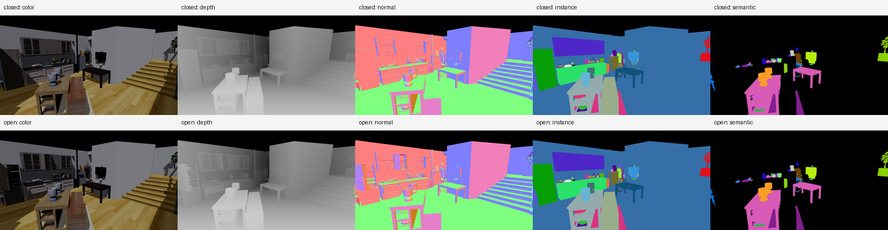
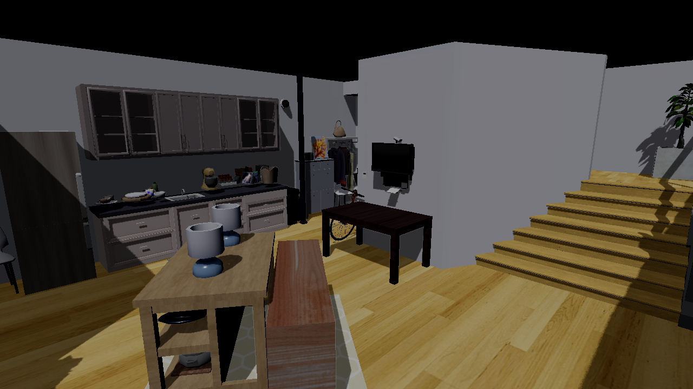

# Flora

Flora 是一个面向具身智能仿真的无头渲染后端，基于 NVIDIA Donut / NVRHI 与 Vulkan。它通过 Python 接收外部仿真器产生的刚体、关节和相机状态，在同一场景中批量渲染多相机观测，并输出可直接用于训练和评测的 NumPy 数据。

当前 Iteration A 已完成：Flora 可以完整装配 ReplicaCAD 场景、驱动 URDF 关节层级，并输出对齐的 Color、Depth、Normal、Instance 和 Semantic。



## 当前功能

| 能力 | 当前实现 |
|---|---|
| ReplicaCAD 完整场景 | 解析 `scene_instance.json`、stage、普通家具和 URDF articulated object；91 个场景配置已通过编译与原生加载 smoke |
| 动态对象与关节 | 保留 `root -> link -> visual` 层级，支持 fixed、prismatic、revolute、continuous joint；稳定句柄批量更新位姿并刷新 TLAS |
| 多相机批量渲染 | 一个 SceneGraph 内维护独立 camera slot；每批只做一次 `Scene::Refresh`，共享 mesh、material、BLAS/TLAS |
| 异步 Color 路径 | `submit_frame_batch()` / `read_frame_batch()`、EventQuery、默认 K=4 readback ring 与占用保护 |
| 多模态 Sensor | 同一场景状态和相机视图下输出 Color、Depth、Normal、Instance、Semantic，支持按产品选择 |
| 稳定标签 | Instance ID 在关节运动前后保持不变；ReplicaCAD 普通对象映射 Semantic ID，0 保留给背景或 unknown |
| Python 集成 | 提供 `GenesisStyleRenderer` 和 `donut_render_py.Scene`，支持单相机与多相机 `SensorFrame` 接口 |
| 光照与阴影 | 支持环境光、方向光以及可选的 Vulkan RT 直接光阴影 |

Sensor 输出合约：

| 产品 | Shape | Dtype | 定义 |
|---|---|---|---|
| Color | `[H, W, 4]` | `uint8` | RGBA8 |
| Depth | `[H, W]` | `float32` | 相机光轴方向线性距离，单位米；背景为 0 |
| Normal | `[H, W, 3]` | `float32` | world-space unit shading normal |
| Instance | `[H, W]` | `uint32` | 稳定逻辑对象 ID；背景为 0 |
| Semantic | `[H, W]` | `uint32` | ReplicaCAD semantic ID；背景或 unknown 为 0 |

## 动态场景示例

下面是同一个 `apt_0` 场景在关闭与打开 26 个可动关节后的结果，均开启 Vulkan RT 直接光阴影。场景包含 stage、113 个普通对象、6 个 articulated object 和 171 个原生 mesh instance。

<table>
  <tr>
    <th>关闭姿态</th>
    <th>打开姿态</th>
  </tr>
  <tr>
    <td></td>
    <td></td>
  </tr>
</table>

在 RTX 3070 Laptop GPU 的 RT off 阶段基线上，128×96、动态更新 26 个关节、同步 CPU readback 时，Color-only 在 C=1/4/8 达到 `1,773 / 3,671 / 4,082 cam-FPS`，五产品达到 `807 / 1,212 / 1,177 cam-FPS`。1000 帧动态五产品压力测试通过，RSS 增长 `0.63 MiB`。这些数字用于回归，不代表跨机器的绝对性能。

## Python 接口

完成场景注册和相机创建后，核心调用形式如下：

```python
from rtxns_genesis_style import CameraDesc, GenesisStyleRenderer

renderer = GenesisStyleRenderer()

# 外部物理模块每帧提交 rigid / link pose。
renderer.update_rigid("object_name", world_matrix)

frame = renderer.render_sensor(
    camera,
    products=("color", "depth", "normal", "instance", "semantic"),
)
frames = renderer.render_sensor_batch(
    (camera_0, camera_1),
    products=("color", "depth", "instance"),
)

rgba = frame.color
depth_m = frame.depth
instance_id = frame.instance
```

完整的几何注册、动态更新与多相机示例见 [`tools/donut_render/genesis_multimodal_smoke.py`](tools/donut_render/genesis_multimodal_smoke.py)。ReplicaCAD 场景编译和五产品验证见 [`tools/render_replicacad_multimodal.py`](tools/render_replicacad_multimodal.py)。

## 构建与运行

当前主要验证环境为 Windows 10/11、NVIDIA RTX GPU、Vulkan 1.3、Visual Studio 2022、CMake 3.20+ 和 Python 3.10+。

```powershell
git clone --recursive https://github.com/xio-md/Flora.git
cd Flora

cmake -S . -B build -DDONUT_WITH_VULKAN=ON -DRTXNS_BUILD_DONUT_RENDER_PYTHON=ON
cmake --build build --config Release --target DonutRenderPyNative

python tools/donut_render/genesis_multimodal_smoke.py
```

运行 ReplicaCAD 示例前，将数据集放在仓库根目录的 `ReplicaCAD/`，然后执行：

```powershell
python tools/render_replicacad_multimodal.py --scene apt_0
```

结果默认写入 `output/replicacad_a4/`。

## 当前边界

- 当前支持 `B=1, C>1`：多个相机共享一个环境状态，尚未实现多个独立并行环境。
- Color 已有异步 readback；多模态产品目前仍走同步 CPU readback。
- 位姿通过 CPU / pybind matrix 提交，输出为 NumPy；GPU PoseSource、Torch/Taichi/DLPack tensor 尚未实现。
- Flora 当前只负责渲染，不包含碰撞、动力学或关节约束求解。
- 当前版本是动态具身视觉 reference，尚不能视为 SAPIEN `RenderSystemGroup` 的性能等价实现。

## 文档

- [Iteration A 阶段总结](docs/RTXNS_Iteration_A_Stage_Summary_2026-07-18.md)
- [A4 多模态 Sensor 周报](docs/RTXNS_ReplicaCAD_Multimodal_Week_A4_Report.md)
- [动态具身仿真推进方案](output/RTXNS_Dynamic_Embodied_Sim_Plan.md)

## License

项目采用 [MIT License](LICENSE.MD)。第三方依赖遵循各自许可证。
