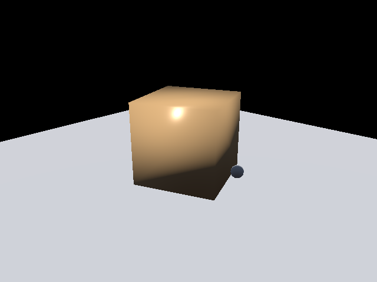
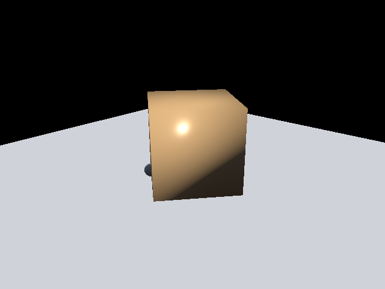

# 仿真器渲染后端（Donut + Vulkan + Python）

这个仓库是实验室仿真器里的渲染后端组件，目标是提供：

- 可在 Python 里直接调用的离屏渲染接口；
- 面向仿真循环的场景更新与多帧渲染能力；
- 可集成到自动化评测流水线的稳定输出（图像与清单）。

核心依赖是 `external/donut`，渲染路径基于 Vulkan 的无头后端。

## 许可说明

`external/donut/LICENSE.txt` 使用的是非常宽松的 MIT 风格许可（可商用、可修改、可分发）。

本项目按同样的宽松思路开源，仓库根目录的 `LICENSE.MD` 采用 MIT 许可文本；第三方依赖仍分别遵循其各自许可证。

## 本仓库包含内容

- `src/PythonBindings/`：C++ 侧 pybind 绑定与 headless PBR 渲染实现；
- `python/donut_render_py`：面向调用方的 Python 运行时封装；
- `python/rtxns_genesis_style`：贴近仿真器调用风格的封装层；
- `samples/`：可直接运行的 Python 示例；
- `tools/donut_render/`：冒烟测试、增量路径验证、性能小工具。

## 快速开始

### 1) 拉取代码

```bash
git clone --recursive <仓库地址>
cd <仓库目录>
```

若仓库已存在：

```bash
git submodule update --init --recursive
```

### 2) 构建 Python 原生模块

```powershell
cmake -S . -B build
cmake --build build --config Release --target DonutRenderPyNative
```

默认产物路径：

- Windows: `bin/windows-x64/DonutRenderPyNative.pyd`
- Linux: `bin/linux-x64/DonutRenderPyNative.so`

### 3) 运行示例

```powershell
cd <仓库根目录>
$env:PYTHONPATH = "$PWD\python"
python samples\DonutRenderPyDemo\donut_render_demo_v0_5.py --module-dir "$PWD\bin\windows-x64" --output-dir "$PWD\.temp\demo_out"
```

Linux 下把 `--module-dir` 改为 `bin/linux-x64` 即可。

## 示例输出

下面这些图片是当前 Python 示例直接生成的帧（`samples/GenesisStylePy`）：




