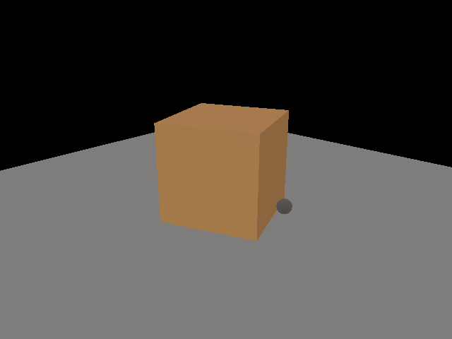
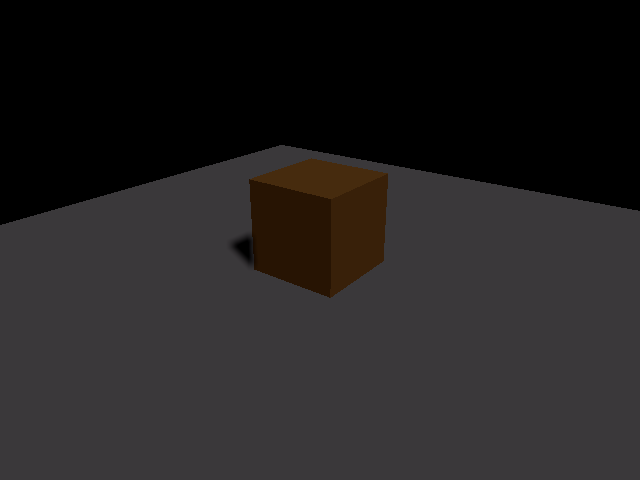
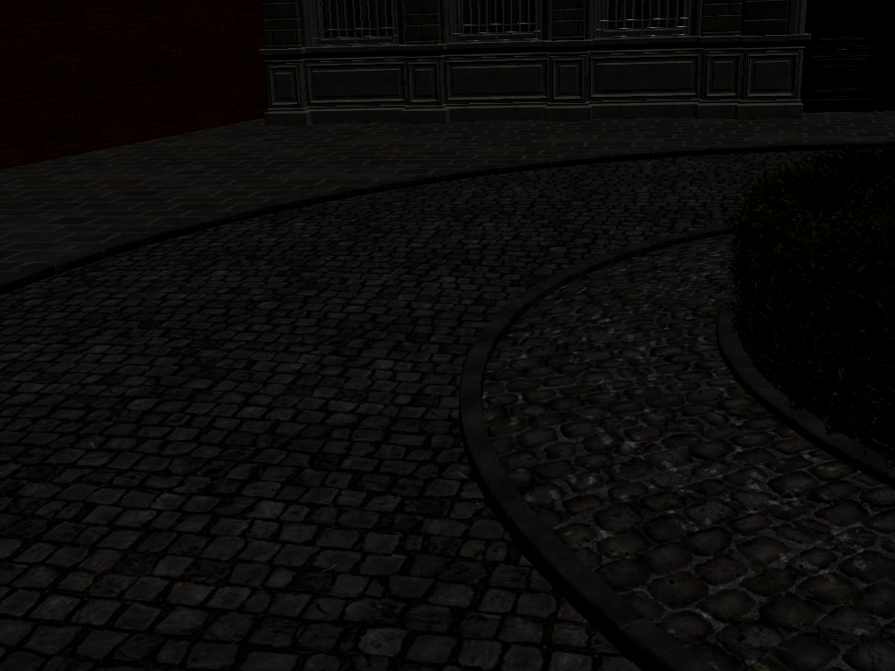
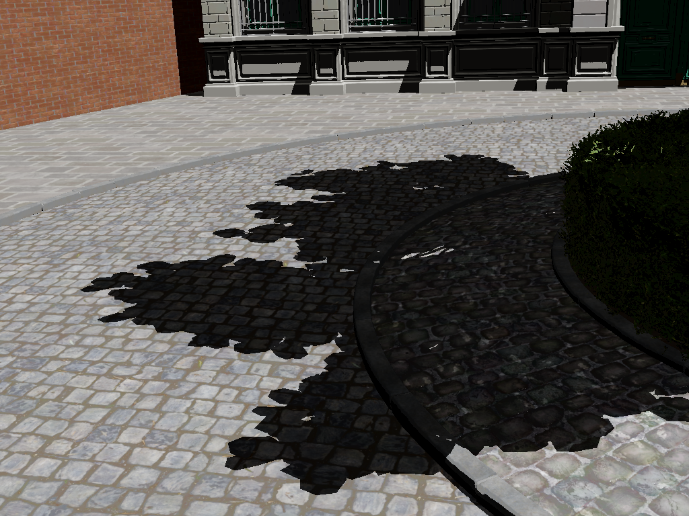
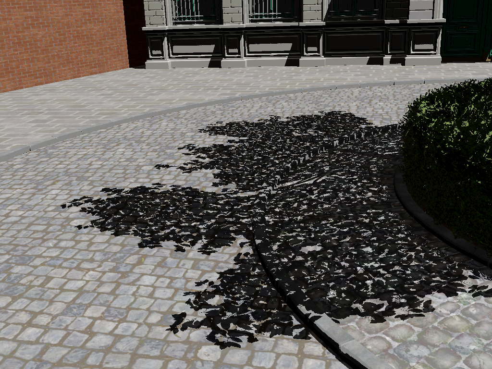

# Flora 光追阴影管线 Phase 1 开发报告

## 概述

本阶段为 Flora 渲染器新增了完整的 Vulkan Ray Tracing 阴影管线（BLAS/TLAS 构建、Ray Query 计算 Shader、阴影合成），并在简单测试场景和复杂 Bistro glTF 场景上验证了从"无阴影"到"不透明硬阴影"到"透明度贴图精细阴影"的递进效果。

---

## 开发前状态（Baseline）

原始 Flora 渲染管线仅支持纯光栅化 ForwardShadingPass，无任何光线追踪能力。



*图1: Genesis 程序化场景 — 纯光栅化 PBR，无阴影（Phase 1 之前的 baseline）*

---

## 阶段一：基础光追硬阴影（Genesis 场景）

**新增能力**：BLAS/TLAS 构建、Ray Query 阴影查询、Shadow Composite 合成。



*图2: Genesis 场景启用 RT 阴影 — 橙色立方体下方地面出现方向性阴影（2.9% 像素被暗化）*

| 对比 | 无阴影均值 | RT 阴影均值 | 暗化像素 |
|------|-----------|-----------|---------|
| Genesis 场景 | 81.8 | 81.6 | 2.9%（局部硬阴影） |

---

## 阶段二：复杂场景加载 + 不透明阴影（Bistro）

**新增能力**：Bistro GLTF (551 mesh/2909 instance) 加载与 BLAS/TLAS 构建，HDR→SDR 曝光控制。



*图3: Bistro 场景无阴影渲染 — 纹理、材质、树叶正常显示*



*图4: Bistro 不透明阴影 — 所有 alpha-tested 叶片按整块面片处理，阴影呈大片粘连*

| 对比 | 无阴影均值 | 不透明阴影均值 | 暗化像素 |
|------|-----------|--------------|---------|
| Bistro | 141.6 | 85.2 | 44.2% |

---

## 阶段三：Alpha-Tested 精细阴影（Bistro）

**新增能力**：Ray Query 候选遍历、三角形 UV 重建、透明度贴图采样、Alpha Cutoff 判断。



*图5: Bistro Alpha-Tested 精细阴影 — 树叶阴影从大块粘连变为细碎片状孔洞*

| 对比 | 不透明阴影 | Alpha 精细阴影 | 暗化像素变化 |
|------|----------|---------------|-------------|
| Bistro | 43.9% 像素暗化 | 37.1% 像素暗化 | 减少 6.8%（错误遮挡被移除）|

---

## 新增文件清单

```
src/RayTracedShadow/
├── ShadowTypes.h                    # 通用类型：ShadowConstants, GPUMeshDesc
├── SceneGeometryProvider.h/.cpp     # 场景几何提取 + 合并顶点/索引缓冲区
├── AccelerationStructure.h/.cpp     # BLAS/TLAS 构建
├── RayTracedShadowPass.h/.cpp       # 阴影管线管理 (pipeline, binding, dispatch)
└── shaders/
    ├── shadow_types.hlsl            # HLSL 端类型
    ├── shadow_rayquery_cs.hlsl      # 阴影 Ray Query 计算 Shader
    ├── shadow_composite_cs.hlsl     # 阴影合成 Compute Shader (+ filmic tonemap)
    └── shaders.cfg                  # ShaderMake 编译配置
```

修改文件：`src/CMakeLists.txt`, `src/PythonBindings/CMakeLists.txt`, `headless_pbr.h/.cpp`, `py_bindings_common.h`

---

## 关键修复记录

| 问题 | 根因 | 修复 |
|------|------|------|
| 深度重建错误（wpos.y 偏移-1） | HLSL 默认 `column_major` vs Donut 行向量约定 | `#pragma pack_matrix(row_major)` + 正确 UV 公式 |
| 地面自遮挡 | Shadow ray 命中自身 receiver | Instance mask 分离 (receiver=0x01, caster=0xFF, ray=0xFE) |
| Composite sRGB 变暗 | SRGBA8 SRV 读取触发 sRGB→linear 转换 | `m_litColorSRV` 改为 RGBA8_UNORM |
| Bistro 全白过曝 | Donut PBR IBL 溢出到 SDR 目标 | 颜色目标改为 RGBA16_FLOAT + filmic tonemap |
| Alpha-test 循环 GPU 超时 | Bistro 2909 实例手动候选遍历过慢 | 多次迭代优化（见 alpha-test 专项文档） |

---

## 后续工作规划

### 产业背景与动机

当前主流 3A 游戏的植被渲染管线普遍采用 **UE5 Nanite + Virtual Shadow Maps (VSM) + WPO** 方案：

```
Nanite（高精度几何 LOD）
  → VSM（虚拟阴影图，分页分配 GPU 分辨率）
    → WPO（顶点动画，模拟风吹草动）
```

这条管线的核心优势在于其通用性和成熟度，但在植被密集型场景中存在一个固有问题：VSM 在处理 Alpha-Tested 叶片时，需要在阴影图生成阶段对大量微三角形逐像素执行 alpha test。当相机靠近植被、WPO 每帧更新顶点位置时，阴影图的 overdraw 和采样开销急剧上升。现有的缓解手段（dither alpha、降低阴影图分辨率）都会直接损失阴影细节——叶片间隙丢失、边缘锯齿严重。

**OMM（Opacity Micromap）提供了一种全新的解决思路**：将 alpha 纹理预烘焙为微三角形粒度的 opacity 状态紧凑编码。在阴影管线中，OMM 可以快速判定哪些微三角形完全透明（无需阴影处理）、哪些完全不透明（直接投全黑阴影）、哪些需要精细 alpha test。这种预分类天然适合植被场景，且已在 NVIDIA Ada Lovelace 架构中获得硬件加速支持。

值得注意的是，虽然 OMM 的 Vulkan API 设计在 Ray Tracing 扩展中，但 OMM 烘焙出的 **opacity 状态数据本质上是与 API 无关的紧凑编码**——理论上可以喂给光栅化管线的任何阶段。这为 OMM 在非 RT 管线中发挥作用提供了可能性。

### Flora 渲染器的定位

Flora 是一个自建的轻量化 Vulkan 渲染器，目标不是复制 UE 的功能完整性，而是：

- **保持管线可控**：每个 Pass 的 shader、资源绑定、调度策略都可以精确调整
- **聚焦渲染质量**：对植被场景的光影效果做精细优化
- **快速原型验证**：新算法可以先在 Flora 中验证，再迁移到 UE 中对比测试

关于与 UE 的对比实验：OMM 提升光栅化阴影质量的工作可以 **先在 Flora 中完成原型和算法验证**，然后通过 UE5 的插件机制将核心方法迁移到 Nanite+VSM 管线中进行性能-质量评估。Flora 的工程开发不追求替代 UE，而专注于轻量化和渲染质量优化，同时服务学术验证。

### 后续工程开发

#### Phase 2: OMM 基础集成

- 构建 NVIDIA OMM SDK 静态库并链接到 Flora
- CPU Baker 接入：从 Donut 材质提取 Alpha 纹理 → 配置 Bake 参数（格式、细分级别、采样器）→ 输出 OMM 数据
- Vulkan OMM Array 构建与 BLAS OMM 附着（pNext chain）
- OMM 2-State 阴影启用：利用硬件加速跳过已确认不透明的微三角

参考：Niagara 渲染器的 OMM 集成实现（场景缓存、BLAS 构建、OMM AS 构建）、OMM SDK 的 minimal sample

#### Phase 3: 面向光栅化阴影的 OMM 加速

- 实现基础 Shadow Map / VSM Pass（作为对比基线）
- 设计 OMM 预剔除 Compute Pass：在生成阴影图前查询 OMM 状态，跳过完全透明微三角，仅对 Unknown 状态执行完整 alpha test
- 探索 OMM 数据在 **RT Shadow + Raster Shadow 双管线** 中的复用：同一份 OMM 烘焙结果同时用于 Ray Tracing 和光栅化阴影
- GPU Baker 集成：处理 WPO 动画场景下的每帧 OMM 重烘焙

#### Phase 4: 工程完善

- Python API 暴露 OMM 配置参数（格式、细分级别、baker 选择）
- 自动批量实验脚本：遍历多个场景与配置组合，自动收集性能和质量数据
- 实验数据可视化

### 可凝练的学术研究方向

上述工程路线围绕一个核心命题展开：**OMM 作为一种与 API 无关的 opacity 紧凑编码，能否提升传统光栅化阴影管线的质量和效率？**

具体可探讨的研究问题：

| 研究问题 | 实验方法 |
|---------|---------|
| OMM 预剔除能减少多少 VSM 的 alpha test overdraw？ | 对比纯软件 Alpha-Test 基线与 OMM 加速的 shadow map 生成时间 |
| OMM 2-State vs 4-State 在光栅化阴影中有什么区别？ | 在 Bistro 及额外植被场景中分析两种格式的阴影细节与内存对比 |
| OMM 数据在 RT Shadow + Raster Shadow 双管线中复用能减少多少额外开销？ | 对比"双管各自烘焙"与"单 OMM 双管复用"的烘焙耗时和内存占用 |
| GPU Baker 在 WPO 动画场景下的实时性如何？ | 对比 CPU Baker（离线）和 GPU Baker（运行时）在动画帧内的烘焙耗时 |

预期贡献：
1. 提出 OMM 在非 RT 管线中的应用方法和实验验证，补充当前学术界在此方向上的空白
2. 提供 OMM 多维度系统评估数据（质量、性能、内存），可作为工程应用的参考基准
3. 展示 OMM 在混合渲染管线中的数据复用潜力
