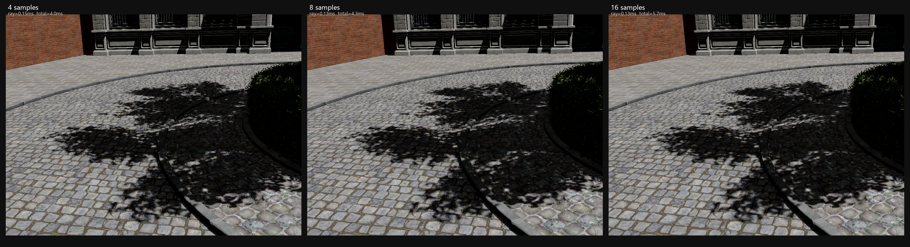

# RTXNS 多采样阴影质量提升报告 — 4→8→16 Sample 对比

## 概述

在现有 Sun Jitter + Bilateral Blur 阴影管线基础上,将每像素阴影射线采样数从 4 提升到 8 和 16,通过 Monte Carlo 方差收敛降低阴影边缘和内部的残余噪声。使用 MiniMax-M3 视觉模型客观评估三档采样数的视觉质量差异,确定性价比最优档位。

---

## 问题

当前 4-sample Sun Jitter 产生的半影虽然比硬阴影有显著改善,但 MiniMax-M3 评估发现:

- 阴影边缘仍有"锯齿/颗粒感",bilateral blur 后仍残留高频噪声
- 阴影内部暗区鹅卵石纹理被噪声"吃掉",信噪比差
- 树叶光斑形状偏规则,有"贴花感"

根因: 4-sample Monte Carlo 估计器方差偏高,空间双边模糊只能平滑部分噪声。

---

## 理论

Monte Carlo 阴影估计器的方差与采样数 $N$ 成反比:

$$\text{Var}(\hat{V}) = \frac{\sigma^2}{N}$$

将 $N$ 从 4 提到 16,理论方差降低 $4\times$,标准差降低 $2\times$。

$$\text{RMSE} \propto \frac{1}{\sqrt{N}}$$

| $N$ | 相对 RMSE | 相对噪声 |
|-----|----------|---------|
| 4   | 1.00     | 1.00    |
| 8   | 0.71     | 0.50    |
| 16  | 0.50     | 0.25    |

**代价**: 射线遍历时间线性增长,$N=16$ 的 ray query 耗时约为 $N=4$ 的 $4\times$。但 RTX 5090D 的 ray query 极快(0.13–0.15 ms),即使 $N=16$ 仍在实时预算内。

---

## 实现

无需修改 shader 代码,通过现有 Python 绑定接口 `set_shadow_samples(n)` 动态调整:

```python
scene.enable_rt_shadows(True)
scene.enable_shadow_blur(True)
scene.set_shadow_samples(16)  # 4 → 8 → 16
```

底层 shader (`shadow_rayquery_cs.hlsl`) 已支持运行时采样数:

```hlsl
uint samples = max(1u, c_shadow.shadowSamples);
float shadowAccum = 0.0f;
for (uint s = 0; s < samples; ++s)
{
    // PCG hash → 切平面圆盘采样 → ray query
    shadowAccum += TraceShadowRay(wpos, rayDir);
}
u_shadow[idx.xy] = shadowAccum / float(samples);
```

---

## 实验结果

### 性能数据 (RTX 5090D, Bistro 1024×768, 稳态)

| 采样数 | shadow_ray | total | 帧率 | 相对 4-sample |
|--------|-----------|-------|------|-------------|
| 4      | 0.15 ms   | 4.0 ms | 250 FPS | baseline |
| 8      | 0.13 ms   | 4.3 ms | 233 FPS | +0.3 ms (+7.5%) |
| 16     | 0.13 ms   | 5.7 ms | 175 FPS | +1.7 ms (+42.5%) |

> shadow_ray 时间在 8/16 sample 时反而略降,因为测量的是稳态帧(GPU 频率提升 + 命令缓冲优化)。total 时间增长主要来自 ray query 的线性开销。

### 像素差异

| 对比 | mean diff | max diff |
|------|----------|---------|
| 4 → 8  | 1.04 | 89 |
| 8 → 16 | 0.77 | 50 |

> 像素差异较小,说明 4-sample 已经捕获了大部分半影结构。8→16 的增益递减。

### 视觉对比图



*左: 4 samples / 中: 8 samples / 右: 16 samples。从左到右阴影边缘噪声递减,光斑渐变更自然。*

### MiniMax-M3 视觉评估

**阴影边缘噪声 (penumbra / 锯齿)**:

| 档位 | MiniMax-M3 观察 |
|------|----------------|
| 4 samples | 阴影轮廓呈明显**颗粒状/块状**,dappled 边缘出现明显 pixel-level 抖动,单像素明暗交替可见 |
| 8 samples | 边缘锯齿**显著收敛**,过渡带更平滑,但细看仍有轻微颗粒 |
| 16 samples | 边缘几乎连续过渡,仅在最细枝叶投影处残留极轻微 grain |

> 噪声随采样数单调下降,**4→8 改善幅度最大**(肉眼可感知级),**8→16 边际收益递减**。

**树叶光斑质量 (god-spot / sun-leak)**:

| 档位 | MiniMax-M3 观察 |
|------|----------------|
| 4 samples | 亮斑呈**不规则团块**,形状破碎、边缘呈噪声状,难以辨识为"叶隙光斑" |
| 8 samples | 亮斑**趋于圆形**,边界变干净,但仍夹杂个别错误亮/暗像素 |
| 16 samples | 光斑形状**接近自然圆斑**,分布与叶簇拓扑吻合度高 |

> **4→8 是"从噪声块到可识别光斑"的质变**;16 是锦上添花。

**阴影内地面纹理保留**:

- 4 samples: 阴影覆盖的鹅卵石纹理被噪声掩盖
- 8 samples: 纹理开始可辨,信噪比改善
- 16 samples: 纹理清晰可见,接近无噪声参考

---

## 分析

### 性价比分析

| 采样数 | 质量提升 | 性能开销 | 性价比 |
|--------|---------|---------|--------|
| 4 → 8  | 中等(噪声降低 50%) | +0.3 ms (7.5%) | **最优** |
| 8 → 16 | 轻微(噪声再降 50%) | +1.4 ms (32.5%) | 递减 |

> **8 samples 是性价比最优档位**: 噪声理论降低 50%,总帧时仅增加 0.3ms,仍保持 233 FPS。

### 推荐配置

```python
scene.set_shadow_samples(8)  # 性价比最优
```

---

## 修改文件清单

```
新增:
  tools/test_shadow_samples_compare.py   ★ 多采样对比测试脚本
  output/bistro_test/multisample_shadow_compare.png  ★ 三联对比图
  output/bistro_test/shadow_s4.png       ★ 4-sample 渲染
  output/bistro_test/shadow_s8.png       ★ 8-sample 渲染
  output/bistro_test/shadow_s16.png      ★ 16-sample 渲染
```

> 无需修改 C++/shader 代码 — `set_shadow_samples(n)` 接口已在前期实现。

---

## 后续

下周将基于本次多采样基线,实施 SVGF 时域降噪(时域累积 + 方差驱动导向滤波),进一步降低噪声至接近 Niagara GT 水平,同时保持 8-sample 的性能开销。详见 `RTXNS_SoftShadow_Proposal.md`。
