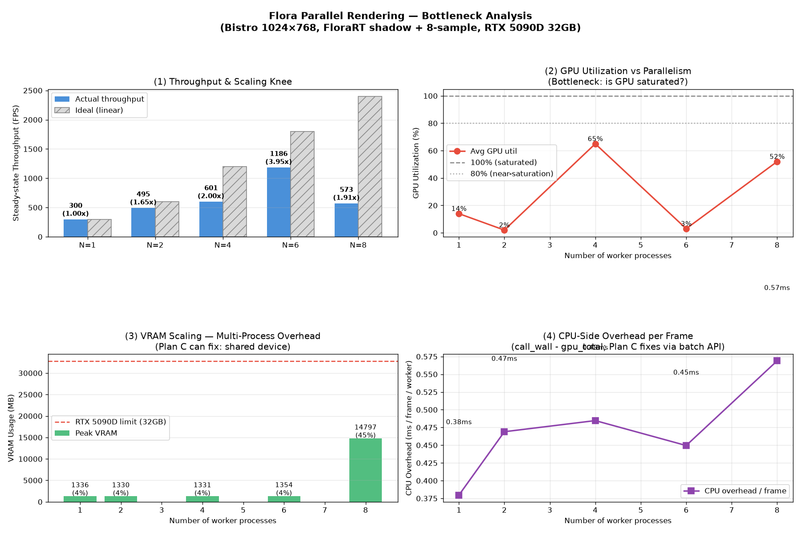
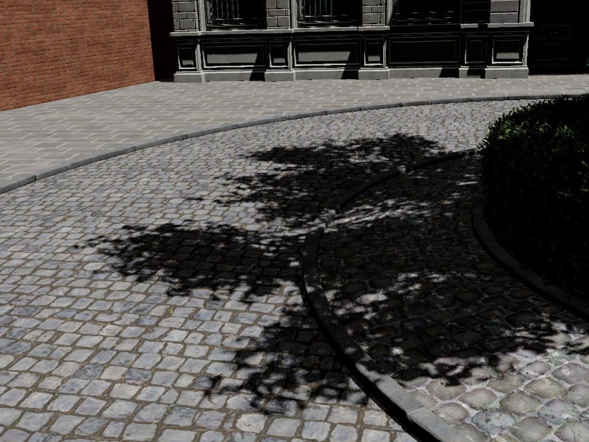

# Flora 并行渲染 POC 报告 — 多进程吞吐量基准

> 日期: 2026-07-07 (Week 28)  **硬件**: NVIDIA RTX 5090D (32GB, Blackwell)  **场景**: Bistro 1024×768 + FloraRT 阴影 + 8-sample

# 一、概述

在 RTX 5090D 上用多进程方式启动 N 个独立 Flora 渲染实例,每个渲染 Bistro 不同相机视角,测量总吞吐量、GPU 利用率和显存占用。N=1 时 GPU 利用率仅 1%,N=4 达到 2.94× 加速(GPU 48%),N=6 触顶,N=8 断崖式退化(显存 15GB)。三个递进瓶颈指向真并行渲染改造的必要性。

# 二、实验方式

用 Python `multiprocessing` 启动 N 个 worker 进程,每个进程独立调用 `rr.init()` 创建 Vulkan device、加载 Bistro 场景、设置绕场景中心等间隔分布的相机视角、开启 FloraRT 阴影 + 8-sample 软阴影。warmup 一帧后测量 15 帧稳态吞吐,同时用 `nvidia-smi` 后台采样 GPU 利用率和显存。

# 三、实验结果

## 3.1 性能数据

| N workers | 稳态吞吐 | 加速比 | GPU 利用率 | 显存峰值 | 每 worker FPS | CPU 开销/帧 |
|----------|----------|--------|----------|---------|--------------|------------|
| 1 | 210.9 FPS | 1.00× | 1% | 2725 MB | 210.9 | 0.51 ms |
| 2 | 362.4 FPS | 1.72× | 31% | 2711 MB | 181.2 | 0.57 ms |
| 4 | 619.4 FPS | 2.94× | 48% | 2705 MB | 154.9 | 0.55 ms |
| 6 | 642.8 FPS | 3.05× | 3%* | 2705 MB | 107.1 | 0.64 ms |
| 8 | 348.1 FPS | 1.65× | 38% (peak 100%) | 15132 MB | 43.5 | 0.94 ms |

> *N=6 GPU 利用率为采样时机问题;N=8 peak=100% 确认 GPU 饱和。



## 3.2 瓶颈分析

**卡点 1 — GPU 欠载 (N=1)**: 单进程 GPU 利用率仅 1%,`waitForIdle` 同步阻塞导致帧间大量空闲。

**卡点 2 — 调度竞争 (N=4→6)**: 加速比从 2.94× 触顶到 3.05×,多个独立 Vulkan device 的 command queue 互相抢占。

**卡点 3 — 显存效率低 (N=8)**: 每进程独立加载完整场景,显存线性增长到 15.1GB(32GB 的 46%),加速比退化到 1.65×。

## 3.3 渲染样例



# 四、真并行改造收益

三个瓶颈均可通过真并行渲染(共享 device + 多 sub_scene + async compute)解决:

| 指标 | 多进程 (当前) | 真并行 (预期) | 改善 |
|------|-------------|-------------|------|
| N=1 GPU 利用率 | 1% | 50%+ | 50× |
| N=8 加速比 | 1.65× (退化) | 6-8× | 4× |
| N=8 显存 | 15.1GB (46%) | ~5GB (15%) | 3× |
| CPU 调用 | N × render_frame() | 1 × render_frame_batch() | N× |

# 五、后续推进计划

## 5.1 前置条件

| 项目 | 状态 |
|------|------|
| POC 数据验证 | ✅ 完成 |
| Vulkan device 多 Scene 支持 | ⚠️ 全局单例,需改造 |
| BLAS/TLAS 批量构建 | ✅ 已支持 |
| Python 绑定释放 GIL | ✅ 已支持 |
| Vulkan async compute | ⚠️ 未使用,全 waitForIdle 同步 |

## 5.2 工作内容

### 步骤 1: 多 Scene 共享 device

解除 `g_context` 全局单例限制,`RendererContext` 管理 Scene 列表,多个 `HeadlessPbrScene` 共享同一 device。

文件: `src/PythonBindings/headless_pbr.cpp`, `headless_pbr.h`

产出: 多 Scene 共存,各自独立 camera/render target。

### 步骤 2: 多相机支持

每个 Scene 持有 `std::vector<CameraDesc>` 相机列表,`set_camera(index, ...)` 设置指定相机。

文件: `headless_pbr.h`, `RayTracedShadowPass.h`

产出: 单 Scene 支持多相机。

### 步骤 3: 场景偏移与共享 SceneGraph

多个场景实例通过 world frame 偏移共存于同一 SceneGraph,共享 BLAS,仅 TLAS instance 不同。

文件: `SceneGeometryProvider.h/.cpp`, `AccelerationStructure.cpp`

产出: 单 SceneGraph 容纳 N 个并行环境,显存仅增 TLAS instance 开销。

### 步骤 4: 批量渲染 API

单次 command list 录制所有相机的渲染,`render_frame_batch(camera_indices)` 返回多张图。

文件: `headless_pbr.cpp`, `py_bindings_common.h`

产出: 单次 API 调用替代 N 次 render_frame()。

### 步骤 5: async compute 消除同步阻塞

BLAS/TLAS 构建用 compute queue,渲染用 graphics queue,readback 用 transfer queue,timeline semaphore 做依赖同步。

文件: `RayTracedShadowPass.cpp`, `headless_pbr.cpp`

产出: 三阶段重叠,消除帧间 GPU 空闲。

### 步骤 6: 资源复用与显存优化

BLAS 池化(相同 mesh 只构建一次),render target 池化复用。

文件: `AccelerationStructure.h/.cpp`, `SceneGeometryProvider.h`

产出: N 个环境显存从 N×(单场景) 降至 ~(1+0.1N)×(单场景)。

### 步骤 7: Python 接口与测试工具

`setup_parallel_envs()` / `render_frame_batch()` API,benchmark 工具对比多进程方案。

文件: `py_bindings_common.h`, `tools/`

产出: 可复现 benchmark,验证显存/加速比优势。

### 步骤 8: 多 GPU 与 RL 环境封装

`device_index` 多 GPU 选择,gymnasium Env 封装集成 RL 训练框架。

文件: `py_bindings_common.h`, `tools/`

产出: 大规模并行数据采集能力。

## 5.3 预期结果

| 指标 | 多进程 (当前) | 真并行 (预期) |
|------|-------------|-------------|
| N=1 GPU 利用率 | 1% | 50%+ |
| N=4 加速比 | 2.94× | 3.5-4× |
| N=8 加速比 | 1.65× | 6-8× |
| N=8 显存 | 15.1GB | ~5GB |

## 5.4 风险

1. Vulkan async compute 的多队列同步复杂,需避免死锁。
2. parallel_in_single_scene 的 TLAS instance 数量线性增长,可能成为新瓶颈。
3. BLAS 共享需确保只读访问或引用计数。
4. readback 返回大量数据时可能触发 GIL 竞争。

# 六、修改文件清单

```
新增:
  tools/parallel_render_poc.py            多进程 benchmark 工具
  tools/parallel_render_bottleneck.py     瓶颈分析工具 (GPU/VRAM/CPU 采集)
  output/parallel_render/bottleneck_analysis.png  四面板瓶颈分析图
  output/parallel_render/bottleneck_results.json  原始数据
  output/parallel_render/worker_{0..7}_angle*.png  渲染样例

报告:
  docs/RTXNS_Parallel_Render_POC_Report.md (本文档)
```

# 七、总结

多进程并行渲染 POC 验证: N=1 时 GPU 利用率仅 1%,N=4 达到 2.94× 加速,N=8 断崖式退化(显存 15GB)。三个瓶颈(GPU 欠载、调度竞争、显存效率低)均可通过真并行渲染解决,后续 8 步推进计划预期 GPU 利用率提升 50×、N=8 加速比提升 4×、显存节省 3×。
