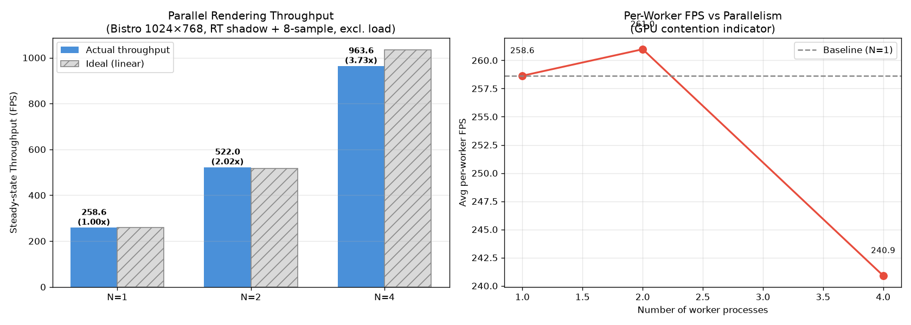

# RTXNS 并行渲染优化汇报

> 日期: 2026-07-12
> 范围: 多进程瓶颈复现、多相机资源模型、同步 batch、异步 readback、ring 安全性与 ReplicaCAD 伸缩验证
> 场景: Bistro 1024x768 + ReplicaCAD Stage_v3_sc0_staging.glb
> 目标: 提升并行渲染效率，减少 Python 调用、command submit、全局 GPU 等待和重复场景资源占用

## 概述

本阶段围绕 RTXNS 当前并行渲染效率偏低的问题，完成了从"多进程并行渲染 POC"到"单进程多相机 batch 渲染"的核心改造。原始方案中，每个 worker 各自创建 renderer、加载场景、构建 BLAS/TLAS，并在每帧 `render_frame()` 末尾执行全局 `waitForIdle()`。这会导致 GPU 欠载、进程间调度竞争和显存线性增长。

本次优化将渲染器内部从单相机结构扩展为多相机 slot 结构，并提供 `render_frame_batch()`、`submit_frame_batch()`、`is_batch_ready()`、`read_frame_batch()` 等接口。渲染提交从 N 次 Python 调用、N 个 command list、N 次 execute/wait，收敛为一次 batch 提交；同时通过 readback ring 和 NVRHI `EventQuery` 把"提交渲染"和"读取结果"解耦，消除稳态全局 `waitForIdle()`。

Bistro 场景中，异步 batch 路径在 N=3 cameras 下达到 **251 FPS**，相比同步 batch 基线 **140 FPS** 提升约 **79%**。收尾阶段进一步完成 ring 占用保护、K 值重配置安全性和 ReplicaCAD 端到端验证；同时通过受控实验否决了"同一 Graphics queue 拆多 cmdList 可以提高吞吐"的假设。

| 指标 | 改造前 / 中间状态 | 当前状态 | 收益 |
|------|------------------|----------|------|
| Python 调用 | N 次 `render_frame()` | 1 次 batch API | N -> 1 |
| command list | N 个 | 1 个 batch command list | N -> 1 |
| `Scene::Refresh` | N 次 | 1 次 | N -> 1 |
| `executeCommandList` | N 次 | 1 次 | N -> 1 |
| 稳态 `waitForIdle` | 每帧/每 batch 1 次 | 0 次 | 全局等待消除 |
| BLAS/TLAS | 多进程 N 份 | 单进程共享 1 份 | 显存和构建开销降低 |
| 同步 batch 基线 | 140 FPS (N=3) | 作为参照 | — |
| 初版异步 | 203 FPS | +45% vs 同步 batch | 初步流水化 |
| 修复后异步 | 251 FPS | +79% vs 同步 batch, +24% vs 初版异步 | Bistro 主结果 |
| `is_batch_ready` | 修复前 `True` (错误提前完成) | 修复后 `False` (正确未完成) | EventQuery 修复生效 |
| submit 耗时 | 6.8 ms/批 | 2.7 ms/批 | CPU 提交更轻 |
| Readback ring | 固定深度 2，无槽位占用保护 | 可配置 K，`occupancyToken` 保护与 hash 验证 | 防止未读帧覆盖 |
| 微批次多 cmdList | 假设可提高 GPU 并行 | 同 queue 无稳定正收益，停止作为优化方向 | 避免无效复杂度 |

---

## 一、问题背景

### 1. 多进程 POC 的瓶颈

前期通过 `parallel_render_poc.py` 复现了多进程并行渲染方案。该方案虽然可以通过多个进程同时渲染不同相机，提高表观吞吐，但工程上存在三个主要瓶颈。

| 瓶颈 | 现象 | 原因 |
|------|------|------|
| GPU 欠载 | N=1 时 GPU 利用率很低 | `render_frame()` 内部同步等待，CPU/GPU 缺少流水 |
| 调度竞争 | N=4 后加速趋缓 | 多个独立 Vulkan device/queue 互相抢占 |
| 显存低效 | N=8 显存可到 15 GB 级别 | 每进程独立加载完整 Bistro 场景和加速结构 |

多进程 baseline 数据如下:

| N workers | 总吞吐 | 加速比 | per-worker FPS |
|-----------|--------|--------|----------------|
| 1 | 224 FPS | 1.00x | 224 |
| 2 | 302 FPS | 1.34x | 164 / 138 |
| 4 | 505 FPS | 2.25x | 92 - 197 |

这些数据说明，简单堆进程不能从根本上解决并行渲染效率问题。更合理的方向是参考成熟渲染器的 batch 思路: 一个 renderer 内部管理多相机视图，共享 scene、texture cache、BLAS/TLAS 和 command submit 边界。

### 2. 原始 RTXNS 内部结构限制

改造前，`HeadlessPbrScene::Impl` 内部使用单份相机和渲染目标:

```cpp
m_camera
m_view
m_color_target
m_depth_target
m_readback_target
m_shadowTarget
m_compositeOutput
```

这种结构只能自然表达一个视角。若要渲染 N 个 camera，只能在外层循环调用 `render_frame()`，导致每个视角重复刷新 scene、录制 command list、提交 GPU、等待 GPU 空闲和 CPU readback。

---

## 二、实现内容

### 1. 多相机资源模型

第一步将 renderer 内部从单相机成员变量扩展为多相机 slot。

核心新增结构:

```cpp
struct CameraDesc {
    std::array<float, 3> position;
    std::array<float, 3> target;
    std::array<float, 3> up;
    float fov_degrees;
    uint32_t width;
    uint32_t height;
    float z_near;
    float z_far;
};

struct RenderViewSlot {
    CameraDesc desc;
    FirstPersonCamera camera;
    PlanarView view;

    TextureHandle colorTarget;
    TextureHandle depthTarget;
    StagingTextureHandle readbackTarget;

    TextureHandle shadowTarget;
    TextureHandle shadowBlurTemp;
    TextureHandle compositeOutput;
    TextureHandle litColorSRV;

    std::vector<ReadbackRingSlot> readbackRing;
    uint32_t ringWriteIdx;
    uint32_t ringDepth = 4;
};
```

参考代码:

| 文件 | 位置 | 说明 |
|------|------|------|
| `src/PythonBindings/headless_pbr.h` | `CameraDesc`, `HeadlessPbrScene` API | 多相机接口声明 |
| `src/PythonBindings/headless_pbr.cpp` | `RenderViewSlot`, `m_views` | 多相机资源容器 |
| `src/PythonBindings/headless_pbr.cpp` | `set_camera_desc()` | 创建/更新相机 slot |
| `src/PythonBindings/headless_pbr.cpp` | `resize_slot_targets()` | 为每个 camera 分配 color/depth/readback/shadow 资源 |

新增 Python/C++ API:

```cpp
uint32_t add_camera(...);
void set_camera_at(uint32_t index, ...);
uint32_t camera_count() const noexcept;
std::vector<uint8_t> render_frame(uint32_t camera_index);
std::vector<std::vector<uint8_t>> render_frame_batch(const std::vector<uint32_t>& camera_indices);
```

旧 API 保持兼容:

```python
img = scene.render_frame()
```

默认仍然渲染 camera 0，不影响已有脚本。

### 2. 同步版 batch 渲染

第二步实现单 command list 批量多相机渲染。核心思想是把原 `render_frame()` 中的渲染步骤拆成可复用录制函数，使多个 camera 在同一个 command list 中依次录制。

同步 batch 路径:

```text
render_frame_batch_v2([0, 1, 2, 3])
  createCommandList()
  open()
  Scene::Refresh()                 1 次
  record_or_build_shadow_as()       1 次，共享 BLAS/TLAS
  for each camera:
      sync_and_record_view()        多次录制 raster/shadow/composite/copy
  close()
  executeCommandList()              1 次
  waitForIdle()                     1 次
  readback_slot()                   多个 camera 逐个读回
```

关键函数:

| 函数 | 作用 |
|------|------|
| `sync_and_record_view(cmdList, camera_index, use_ring)` | 将指定 camera slot 的 view/resource 同步到 legacy 渲染路径，并在传入 command list 上录制完整渲染 |
| `readback_slot(slot)` | 从单个 slot 的 staging texture 读回图像 |
| `render_frame_batch_v2(indices)` | 同步 batch 版本，保留为对照和 fallback |
| `record_or_build_shadow_as(cmdList)` | 当前共享 AS 构建/更新函数，供同步和异步 batch 共用 |

同步版 batch 的主要收益不是最终 FPS，而是打通了结构: Python 调用、scene refresh、command submit、AS 构建从 N 次收敛到 1 次。实验中 N=2 camera 从 277 FPS 提升到 345 FPS，提升约 25%。N=4 时提升较小，主要原因是末尾仍保留 `waitForIdle()`，同步 readback 成为绝对瓶颈。

| N cameras | 旧循环 | 同步 batch | 加速比 | 节省等待 |
|-----------|--------|------------|--------|----------|
| 1 | 643 FPS | 610 FPS | 0.95x | 0 |
| 2 | 277 FPS | 345 FPS | 1.25x | 100 次 |
| 4 | 201 FPS | 207 FPS | 1.03x | 300 次 |

### 3. 异步 readback 与帧流水

第三步将同步 batch 拆成 submit/read 两个阶段，避免每个 batch 末尾全局等待 GPU。

新增 API:

```cpp
uint64_t submit_frame_batch(const std::vector<uint32_t>& camera_indices);
bool is_batch_ready(uint64_t token) const;
std::vector<std::vector<uint8_t>> read_frame_batch(uint64_t token);
```

Python 使用方式:

```python
token0 = scene.submit_frame_batch([0, 1, 2])
token1 = scene.submit_frame_batch([0, 1, 2])

images0 = scene.read_frame_batch(token0)
images1 = scene.read_frame_batch(token1)
```

异步路径:

```text
submit_frame_batch()
  open command list
  Scene::Refresh()
  record_or_build_shadow_as()
  for camera:
      sync_and_record_view(use_ring=true)
  close
  executeCommandList()
  setEventQuery()              标记本次提交后的队列时间点
  store PendingBatch
  return token

read_frame_batch(token)
  find PendingBatch
  waitEventQuery(query)
  map staging ring texture
  copy pixels to CPU bytes
  erase PendingBatch
```

每个 camera slot 新增 readback ring:

```cpp
std::array<ReadbackRingSlot, 2> readbackRing;
uint32_t ringWriteIdx;
```

每次 submit 会把当前写入的 ring index 保存到 `PendingBatch::ringIndices`，read 时不再依赖当前 `ringWriteIdx` 反推槽位，避免读回错位。

### 4. Correctness 修复

异步路径初版暴露了几处关键正确性问题，本阶段已经完成主要修复。

| 级别 | 问题 | 修复 | 当前状态 |
|------|------|------|----------|
| P0 | `EventQuery` 放在 `executeCommandList` 前，导致 `is_batch_ready()` 可能提前返回 | `executeCommandList()` 后再 `setEventQuery()` | 已修复 |
| P1 | readback ring 读回槽位依赖当前 `ringWriteIdx`，连续提交后可能读错 | `PendingBatch` 保存每个 camera 的 `ringIndices` | 已修复读回定位 |
| P1 | camera 0 legacy 状态可能沿用前一个 camera | batch 的 `sync_and_record_view()` 与旧 `render_frame_for_index()` 均无条件同步 slot 状态 | 已修复并通过 1→0 hash 验证 |
| P1 | async 路径首帧不构建 AS，RT shadow 可能直接 fallback | 抽出 `record_or_build_shadow_as()`，同步和异步 batch 共用 | 已修复 |
| P2 | OMM bake/cache 未并入 batch AS 构建 | 保留 TODO，计划通过预 bake cache 接入 | 后续处理 |
| P0 | K 从 4 切换到 8 时仅修改字段、未重建 staging ring，导致越界后 GPU 卡死 | pending token 时拒绝切换；空闲后重建每个 slot 的 ring | 已修复并验证 |
| P2 | 多 cmdList 试图在同一 Graphics queue 获得并行 | 单次批提交的受控实验仍无稳定正收益 | 已否决，不进入生产路径 |

最新验证结果:

```text
is_batch_ready: False
```

该结果是关键正确性信号。修复前 query 标记在 submit 之前，刚提交后 `is_batch_ready()` 可能立即返回 `True`。修复后返回 `False`，说明 query 正确对应到本次 command list 提交之后的 GPU 队列进度。

---

## 三、实验结果

### 1. 同步 batch 到异步 batch 的收益

实验配置: Bistro 1024x768，RT 阴影关闭，N=3 cameras，20 批。

| 方案 | 吞吐 | submit 耗时 | 每批行为 | 说明 |
|------|------|-------------|----------|------|
| 同步 batch | 140 FPS | 嵌入同步调用 | execute 后 wait/read | 仍有全局等待 |
| 初版异步 | 203 FPS | 6.8 ms/批 | submit/read 分离 | +45%，但存在 EventQuery 提前完成 bug |
| 修复后异步 | 251 FPS | 2.7 ms/批 | query 正确标记提交后时间点 | +79% vs 同步 batch，+24% vs 初版异步 |

吞吐变化:

```text
同步 batch:      140 FPS
初版 async:      203 FPS
修复后 async:    251 FPS
```

收益解释:

1. `waitForIdle()` 被替换为 per-batch `waitEventQuery()`，不再清空整个 GPU 队列。
2. submit 阶段不再阻塞等待 readback，CPU 可以继续提交下一批或执行仿真/训练逻辑。
3. 多相机共享 scene refresh、AS build/update、texture cache 和 command submit 边界。
4. EventQuery 修复后，ready 状态与真实 GPU 完成点一致，避免错误地读取未完成 staging 资源。

### 2. ReplicaCAD 收尾验证与 P2 结论

测试场景为 `ReplicaCAD/stages/Stage_v3_sc0_staging.glb`，RT 阴影关闭。端到端指标均包含 submit、等待完成和 CPU readback，不使用 submit-only FPS 代表观测生成速度。

**Ring 正确性与深度选择**

1. `K=4` 的 K+2 压力测试中，前 4 个 token 正确提交，后 2 个返回 busy；4 张图像的 hash 与同步参考图一致。
2. 已验证已有相机从 `K=4` 切换到 `K=8` 后可连续提交并读回 8 个 token，不再发生 staging vector 越界或 GPU 卡死。
3. 在 512x384、N=4 的一次完整端到端压力测试中，K=2、4、8 分别为 1333、1557、1481 cam-FPS。K=4 在该条件下最佳；该结论仅适用于当前场景和时序，后续动态场景需重新测量。

**P2: 同一 Graphics queue 的多 cmdList 受控实验**

为排除"每个 micro-batch 都单独 execute/query"造成的额外干扰，实验改为：按 micro-batch 录制多个 cmdList，再调用一次 `executeCommandLists(...)` 提交整个有序序列，只设置一个 EventQuery。测试采用 256x192、ring K=8、5 次交错 trial、每 trial 120 个 batch，固定最多 8 个 in-flight batch，并对多 cmdList 输出与单 cmdList 输出做 hash 对照，结果一致。

| 条件 | N=12 mb=4 | N=12 mb=2 | N=8 mb=4 | N=8 mb=2 |
|------|-----------|-----------|----------|----------|
| 两次独立受控套件的相对区间 | -1.1% ~ -11.9% | -13.7% ~ -15.7% | -1.6% ~ -13.2% | -16.9% ~ -22.6% |

结论是：原先"每组独立 submit/query"会放大负收益，但去除该干扰后，粗粒度 `mb=4` 最多接近持平，不能稳定超过单 cmdList；细粒度 `mb=2` 持续更慢。原因不是缺 timeline semaphore，而是同一 Graphics queue 上的 raster 仍顺序执行，拆分不会增加 GPU 并行度。因此 P2 不再作为 RTXNS 的生产优化方向。

### 3. 功能验证

当前验证覆盖:

```text
[1] Sync batch                  OK
[2] Async submit + read         OK
[3] is_batch_ready              False after submit, correct
[4] Pipelined submit/read       OK
[5] Shared AS build path        OK
[6] Release build               OK
[7] Duplicate camera rejection  OK
[8] Legacy camera 1 -> 0 restore OK
[9] Empty sync batch            OK
```

构建验证:

```text
cmake --build E:\cplus\Flora\build-flora --config Release --target DonutRenderPyNative
```

已通过，输出:

```text
E:\cplus\Flora\bin\windows-x64\DonutRenderPyNative.pyd
```

### 4. 阶段性收益汇总

| 工作内容 | 阶段成果 | 核心收益 |
|----------|----------|----------|
| 多进程瓶颈复现 + 多相机资源模型 | `CameraDesc`、`RenderViewSlot`、`m_views`、多相机 API | 建立 baseline，确认多进程显存和调度瓶颈 |
| 单 command list 同步 batch | `sync_and_record_view()`、`render_frame_batch_v2()`、共享 AS | 调用/提交/refresh 从 N→1，显存节省 N 倍 |
| 异步 readback + 帧流水 | `submit_frame_batch()`、`is_batch_ready()`、`read_frame_batch()`、readback ring、EventQuery | N=3 达到 251 FPS（+79%），稳态 `waitForIdle` 为 0 |
| Ring 正确性 + 安全配置 | `occupancyToken`、hash 验证、K 重建 | 防止未读帧覆盖，支持动态切换 ring 深度 |
| ReplicaCAD 伸缩验证 + P2 否决 | 多分辨率、多相机端到端基准 | 确立最优 batch 策略，避免无效优化方向 |

---

## 四、当前代码结构

### 1. 主路径

当前公开同步 batch API:

```cpp
std::vector<std::vector<uint8_t>>
HeadlessPbrScene::render_frame_batch(const std::vector<uint32_t>& camera_indices)
{
    uint64_t token = m_impl->submit_frame_batch_impl(camera_indices);
    return m_impl->read_frame_batch_impl(token);
}
```

这意味着 `render_frame_batch()` 已经复用异步 submit/read 路径，只是对外表现为同步便利函数。训练、仿真或数据采集任务可以直接使用异步 API，手动控制 submit/read 间隔。

### 2. 关键代码参考

| 模块 | 文件 | 函数/结构 | 说明 |
|------|------|-----------|------|
| 多相机 API | `src/PythonBindings/headless_pbr.h` | `CameraDesc`, `add_camera`, `render_frame_batch` | 对外接口 |
| Python 绑定 | `src/PythonBindings/py_bindings_common.h` | `render_frame_batch`, `submit_frame_batch`, `read_frame_batch` | Python 可调用入口 |
| 多相机资源 | `src/PythonBindings/headless_pbr.cpp` | `RenderViewSlot`, `m_views` | 每 camera 独立 view/render target |
| 视角录制 | `src/PythonBindings/headless_pbr.cpp` | `sync_and_record_view()` | 在共享 command list 中录制单个 camera |
| 共享 AS | `src/PythonBindings/headless_pbr.cpp` | `record_or_build_shadow_as()` | batch 内共享 BLAS/TLAS build/update |
| 异步提交 | `src/PythonBindings/headless_pbr.cpp` | `submit_frame_batch_impl()` | 录制、execute、设置 EventQuery、保存 PendingBatch |
| 异步读回 | `src/PythonBindings/headless_pbr.cpp` | `read_frame_batch_impl()` | 等待 token、按 ring index 读回 |
| 状态追踪 | `src/PythonBindings/headless_pbr.cpp` | `PendingBatch` | 保存 token、camera indices、ring indices、query |

### 3. 与成熟渲染器思路的对应

本阶段实现与成熟渲染器的做法保持一致:

| 参考方向 | 成熟实现思路 | RTXNS 当前对应 |
|----------|--------------|----------------|
| SAPIEN batched render | 一次 takePicture 渲染多个 camera，使用 frame counter/semaphore 控制完成点 | `submit_frame_batch()` + `EventQuery` + token |
| LuisaRender command buffer | 在一个 command buffer 中集中记录多视角/多 pass，提交边界集中管理 | `render_frame_batch_v2()` / async command list 内 loop cameras |
| GPU readback pipeline | 多 staging buffer 轮转，避免 CPU map 等待当前 GPU 写入 | 每 camera 可配置 `readbackRing[K]` + slot 占用保护 |
| Shared scene resource | 多视角共享 scene、texture、AS | `m_views` 只保存 view/render targets，scene/AS 全局共享 |

---

## 五、风险与后续收尾

### 1. readback ring 的极端积压（已收口）

当前 `PendingBatch` 已保存每个 camera 的 ring index，解决了"读回时根据当前 `ringWriteIdx` 反推导致读错槽位"的问题。下一步建议补充 ring slot backpressure: 当同一 camera 的同一 ring slot 仍被未读 token 占用时，应阻塞、报错、自动等待最早 token，或将 ring 深度从 2 扩展到 3/4。

这不是当前 N=3 正常流水测试的阻塞项，但会影响后续更深队列的稳定性。

**2026-07-12 收尾更新:** 上述 backpressure 已实现。`PendingBatch` 保存 `(cameraIndex, ringIndex)`，每个 ring slot 再保存 `occupancyToken`；submit 在目标槽位未释放时返回 busy，readback 成功后释放槽位。ring 深度可配置为 K，修改 K 时要求不存在 pending token，并重建对应 staging textures。动态仿真阶段仍需重新验证 K=4 是否最优。

### 2. P2 微批次实验接口的收口

`submit_frame_batch_ex()` 仅用于完成本次多 cmdList 实验。2026-07-18 代码收尾已将它从 C++ API 和 Python binding 中移除；正式数据采集和训练路径只保留 `submit_frame_batch()` 的 single-cmdList 主路径，避免调用方把实验接口误认为并行加速能力。

收尾回归统一改用 `ReplicaCAD/stages/frl_apartment_stage.glb`。正式基线为 1280×720、ring K=4、CPU RGBA8 端到端端点；每个 case 测量 30 个 batch，执行 5 次 sync/async 交错 trial 并报告中位数，测试前以最大相机数预热 20 个 batch。

| RT shadow | C | sync cam-FPS | async e2e cam-FPS | busy |
|---|---:|---:|---:|---:|
| OFF | 1 | 293.7 | 450.7 | 0 |
| OFF | 4 | 311.3 | 400.9 | 0 |
| OFF | 8 | 312.0 | 426.6 | 0 |
| ON，8 samples | 1 | 221.5 | 397.6 | 0 |
| ON，8 samples | 4 | 212.2 | 395.2 | 0 |
| ON，8 samples | 8 | 209.9 | 369.8 | 0 |

RT 的 async 端到端吞吐相对无 RT 在 C=1/4/8 分别下降约 11.8% / 1.4% / 13.3%。C=4 的差异较小，说明 GPU 执行与 CPU readback 流水会掩盖部分 pass 成本；后续汇报必须完整标注相机数、分辨率、RT 配置、统计方式和输出端点。

Ring correctness 在无 RT/RT 两种模式重新验证了 K+2 场景：重复 camera index 在提交前被拒绝；`render_frame(1)` 后回到 camera 0 的输出与参考 hash 一致；4 帧入队后第 5/6 帧返回 busy，随后按 token 逆序读取 4 帧，所有 hash 均匹配。另有无 RT/RT 各 4 个相机的同步输出与异步输出逐相机 SHA-256 全部一致，排除了 EventQuery 提前返回和旧帧复用。1280×720 的 Flora 无 RT/RT ReplicaCAD 示例图在收尾前后 SHA-256 完全一致。

### 3. 旧 `render_frame(index)` 的状态同步收口

batch 主路径中的 `sync_and_record_view()` 已对任意 camera index 无条件同步 slot 状态；旧 `render_frame_for_index()` 也改为无条件从目标 slot 恢复 legacy 状态。无 RT/RT 下的 `render_frame(1)`→`render_frame(0)` 回切 hash 均与 camera 0 参考输出一致，该项已收口。

### 4. OMM 与 async batch 的集成

当前 `record_or_build_shadow_as()` 已统一 batch 路径的 AS 构建，但 OMM bake/cache 逻辑仍保留在单相机 `render_frame()` 路径中。原因是 OMM bake 和 GPU OMM build 当前包含同步等待，与 async batch 的无全局等待目标冲突。

后续建议采用预 bake cache 方式集成:

1. 在正式 batch 前离线或预热阶段完成 OMM bake。
2. batch AS build 只加载 cache 并上传 OMM buffer。
3. 避免 steady-state batch 路径中插入 `waitForIdle()`。

### 5. Benchmark 脚本路径参数化

部分 smoke/benchmark 脚本仍硬编码 `D:\RTXNS` 和 `D:\niagara_bistro`。后续建议统一改成命令行参数或自动从 repo root 推导，避免测到旧二进制或不同场景路径。

---

## 六、修改文件清单

### 核心代码

```text
src/PythonBindings/headless_pbr.h
  + CameraDesc
  + add_camera / set_camera_at / camera_count
  + render_frame(index) / render_frame_batch(indices)
  + submit_frame_batch / is_batch_ready / read_frame_batch
  + set_readback_ring_depth / readback_ring_depth
  - submit_frame_batch_ex（P2 实验结束后已移除）

src/PythonBindings/headless_pbr.cpp
  + RenderViewSlot / m_views
  + set_camera_desc / resize_slot_targets / add_camera_slot
  + sync_and_record_view
  + record_or_build_shadow_as
  + render_frame_batch_v2
  + submit_frame_batch_impl / is_batch_ready_impl / read_frame_batch_impl
  + PendingBatch + readback ring

src/PythonBindings/py_bindings_common.h
  + 多相机 Python 绑定
  + 异步 batch Python 绑定
  + render/read 路径释放 GIL
```

### 测试和工具

```text
tools/smoke_batch_test.py
  多相机 API smoke test

tools/smoke_batch_v2.py
  同步 single-command-list batch 测试

tools/smoke_async.py
  异步 submit/read、is_batch_ready、流水测试

tools/bench_batch_real.py
  多 camera batch vs 旧循环 benchmark

tools/bench_batch_large.py
  N=1/2/4 多规模吞吐对比

tools/test_ring_fix.py
  重复相机拒绝、camera 1→0 回切、K+2、busy、逆序 read 与无 RT/RT hash 验证

tools/bench_replicacad_parallel.py
  生产 single-cmdList 路径的 ReplicaCAD 端到端吞吐基准，原子写入 JSON
```

### 展示材料

```text
output/parallel_render/parallel_render_results.json
output/parallel_render/throughput_compare.png
output/parallel_render/worker_*.png
```



---

## 七、后续计划

下一阶段定位为"并行渲染稳定化 + 调度器 + OMM 预烘焙接入"。

### 1. 每相机成本优化与动态场景基准

- 不再将同 queue 多 cmdList 作为优化方向；正式主路径固定为单 cmdList batch。
- 对 raster、readback、CPU map/copy、binding/constant-buffer 更新分别计时，定位 N=8/12 的真实成本。
- 新增"动态物体数 x 相机数"的 ReplicaCAD 基准，为后续 transform/TLAS dirty 更新提供基线。

### 2. BatchScheduler 与 RenderTargetPool

- 同分辨率 camera 合并为一个单 cmdList batch；不同分辨率自动拆分为独立 batch，而不是并发 micro-cmdList。
- 不同分辨率 camera 自动拆分。
- 控制每批 readback bytes 和 staging texture 数量。
- 输出每批 submit time、GPU wait time、CPU copy time。

### 3. OMM 预 bake cache 接入 batch

- 复用已有 `load_omm_cache()` / `save_omm_cache()`。
- batch AS build 只消费已经 bake 好的 OMM 数据。
- 保证 steady-state async batch 不重新引入 `waitForIdle()`。

### 4. 完整性能报告

建议输出统一 benchmark 表:

| 方案 | N cameras | FPS | submit ms | wait ms | readback ms | VRAM | GPU util |
|------|-----------|-----|-----------|---------|-------------|------|----------|
| 多进程 POC | 1/2/4/8 | 待测 | - | - | - | 待测 | 待测 |
| 旧单进程循环 | 1/2/4/8 | 待测 | 待测 | 待测 | 待测 | 待测 | 待测 |
| 同步 batch | 1/2/4/8 | 待测 | 待测 | 待测 | 待测 | 待测 | 待测 |
| 异步 batch | 1/2/4/8 | 待测 | 待测 | 待测 | 待测 | 待测 | 待测 |
| scheduler | 1/2/4/8/16 | 待测 | 待测 | 待测 | 待测 | 待测 | 待测 |

---

## 结论

本阶段已经完成并行渲染优化的核心路径: RTXNS 从"外部多进程并行"推进到"单 renderer 内多相机 batch + 异步 readback"。目前主路径可以用一次 batch 提交渲染多个 camera，共享 scene/AS，并通过 EventQuery 精确等待单个 batch，不再依赖全局 `waitForIdle()`。

量化收益上，Bistro 1024x768 的 N=3 异步 batch 吞吐从同步 batch 的 140 FPS 提升到 251 FPS，提升约 79%；submit 耗时降到 2.7 ms；`is_batch_ready=False` 验证了 EventQuery 修复生效。收尾阶段补齐了 readback ring 的占用保护与安全重配置，并在 ReplicaCAD 上完成了 hash 正确性、K 值验证和伸缩性测量。

本阶段还得到一个同样重要的负向结论：同一 Graphics queue 的多 cmdList 不会产生相机 raster 并行。即使采用一次 `executeCommandLists(...)` 批提交，粗粒度拆分也只能接近持平，细粒度拆分稳定退化。因此 RTXNS 后续不再投入同 queue micro-batch，而转向每相机成本优化、资源池、动态 transform/TLAS dirty 更新和可复现的动态场景基准。
