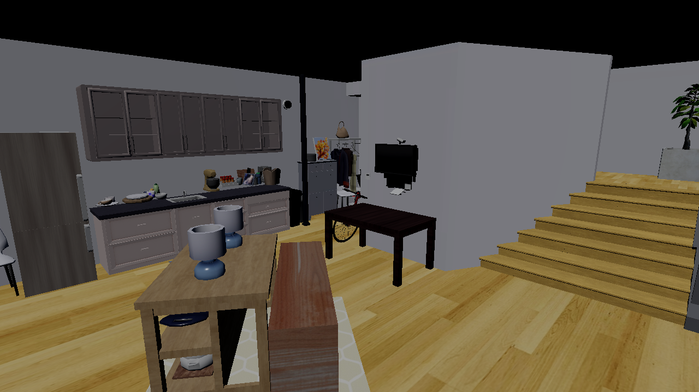
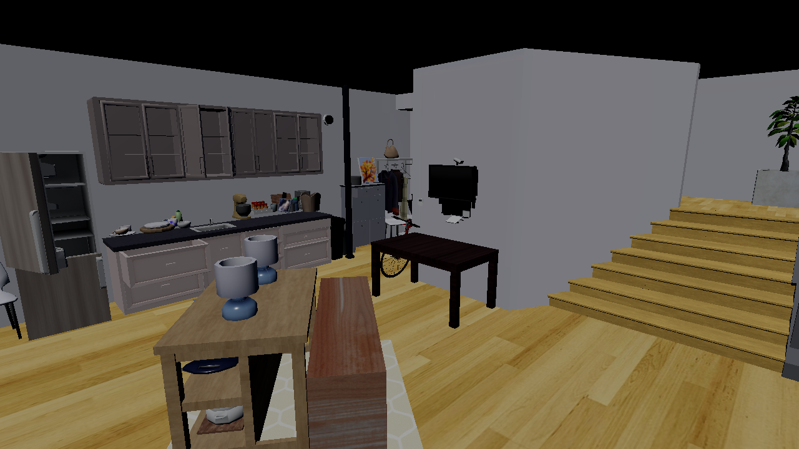
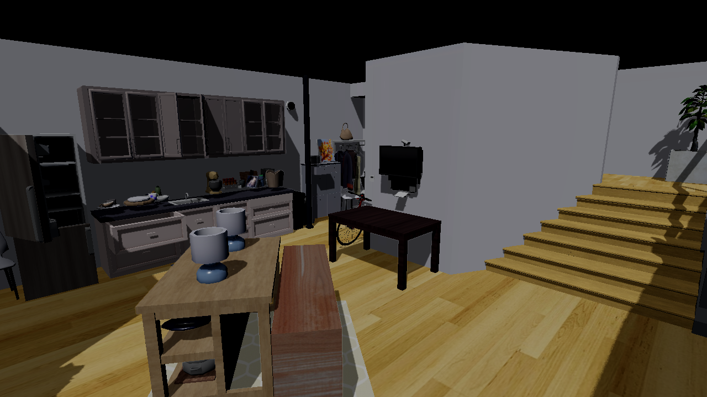

# Flora（RTXNS）引擎周报：ReplicaCAD URDF 动态层级与批量位姿更新

> 汇报日期：2026-07-18（Iteration A / Week A3）
>
> 开发基线：`cf7cb23`
>
> 硬件：NVIDIA GeForce RTX 3070 Laptop GPU（8 GB），驱动 610.74
>
> 数据集：`E:\cplus\Flora\ReplicaCAD`，重点场景 `apt_0`
>
> 本周范围：URDF link/visual 层级、fixed/prismatic/revolute 关节、稳定节点句柄、批量位姿更新、动态 TLAS 更新、Genesis 风格接口接入、91 场景动态资产覆盖
> 不在本周范围：物理求解、多环境 SceneBatch、GPU PoseSource、Depth/Instance/Semantic/Normal、GPU Tensor 输出

## 概述

本周完成 ReplicaCAD Iteration A 的第三阶段。Flora 已不再只是加载静态 stage 和普通家具，而是能够将 `scene_instance.json` 中的 articulated object 编译为完整的 `articulation root -> URDF link -> visual mesh` 层级，并由外部关节状态或 link matrix 驱动门、抽屉、冰箱和橱柜运动。

`apt_0` 的 6 个 articulated object 已全部进入渲染场景，包括 37 个 link 和 31 个 visual mesh。它们与 A2 的 stage、113 个普通对象共同形成 145 个 model-backed render instance。此前因为厨房柜体、冰箱等承载家具未加载而显得悬空的左侧物体，现在具有正确的视觉承载关系。

原生层新增一次加载时建立的连续节点句柄表。Python 在场景加载后一次解析名称，逐帧只传 `handle + 4x4 matrix`；26 个可动关节的一次批量写入中位耗时约 `0.019-0.023 ms`。在 128x96、RT 8 samples 的异步多相机实验中，动态场景 N=8 达到 `4,699 cam-FPS`，保留静态场景吞吐的 `86.1%`。

1000 帧动态 RT 压力测试通过：只加载一次场景，热身后 BLAS 重建次数为 0，节点句柄和原生资源统计完全不变，RSS 增长 `0.13 MiB`。批量更新与逐节点 reference 的 RGBA8 帧 SHA-256 完全一致；运动 1000 帧后恢复初始姿态，世界矩阵误差为 0，栅格帧哈希也完全恢复。

| 本周指标 | A2 / 周初 | A3 / 周末 | 结果 |
|---|---:|---:|---|
| `apt_0` 可见 articulated object | 0 / 6 | 6 / 6 | 完成 |
| `apt_0` URDF link / visual | 0 / 0 | 37 / 31 | 完成 |
| `apt_0` model-backed render instance | 114 | 145 | +27.2% |
| 完整数据集 articulated 覆盖 | 仅 manifest 540 | 540 / 540 原生加载 | 完成 |
| 完整数据集 link / visual | 仅 manifest | 3,330 / 2,790 | 完成 |
| 每批动态关节 | 0 | 26 | 完成 |
| 26 关节原生批量更新 | 无 | `0.019-0.023 ms` | 完成 |
| N=8 动态 RT 吞吐 | 无动态路径 | `4,699 cam-FPS` | 静态的 86.1% |
| 动态长稳态 | 无 | 1000 帧通过 | RSS +0.13 MiB |

---

## 一、问题与目标

### 1. A2 之后的实际缺口

A2 已经把 `apt_0` 的 stage 和 113 个普通对象编译为 Donut SceneGraph，但 6 个 articulated object 仍只存在于 manifest 中。缺失对象包括厨房柜体、冰箱、抽屉柜和门等大型承载家具，因此产生了两个直接问题：

1. 场景视觉不完整，放在柜面或柜体附近的普通物体看起来悬空。
2. 即使外部物理模块给出关节状态，渲染器也没有稳定的 link 节点和批量更新入口。

仅将 URDF visual mesh 平铺成一组普通对象不能解决第二个问题。动态渲染必须保留父子层级，使父 link 运动能够自然传递到子 link 和 visual，并且每帧更新不能重新解析名称、加载 GLB 或构建 BLAS。

### 2. A3 验收目标

1. `apt_0` 的 6 个 articulated object 全部可见。
2. fixed、prismatic、revolute/continuous joint 的局部变换正确。
3. 提供稳定 link handle 和原子批量矩阵更新 API。
4. 1000 帧关节动画无漂移、错 link、资源增长和 BLAS rebuild。
5. 批量 API 与逐节点 reference 输出图像哈希一致。
6. 输出 pose update、SceneGraph refresh、AS/TLAS update record 和剩余 render/readback 四段耗时。
7. 91 个 ReplicaCAD scene instance 全部原生加载，articulated visual 不遗漏。

---

## 二、实现内容

### 1. URDF 层级编译

`python/donut_render_py/donut_scene_compiler.py` 现在为每个 articulated instance 生成稳定的三层结构：

```text
replicacad_articulation_<instance_id>       # scene instance pose + uniform scale
  link_<index>_<link_name>                  # joint origin + joint(q)
    visual_<index>                          # visual origin + mesh scale + model
    child link
```

`CompiledArticulationDesc.graph_node()` 按 URDF parent/child 关系递归构建 SceneGraph。编译器会拒绝以下非法拓扑：

- joint 引用不存在的 parent/child link；
- 一个 link 有多个 parent joint；
- 没有 root link；
- link cycle；
- 从 root 不可达的 link。

普通 GLB 和 URDF visual GLB 共用同一 `model_index_for()` 去重表。`apt_0` 因此只有 101 个唯一模型，而不是为 145 个可渲染实例重复加载模型。

关键代码：

| 文件与位置 | 作用 |
|---|---|
| `python/donut_render_py/scene_desc.py:207` | `ArticulationDesc` 保存有序 link、joint 和 visual |
| `python/donut_render_py/donut_scene_compiler.py:227` | visual/link/articulation 编译数据结构 |
| `python/donut_render_py/donut_scene_compiler.py:618` | `_compile_articulation()` 拓扑校验和节点生成 |
| `python/donut_render_py/donut_scene_compiler.py:744` | 普通对象与 URDF visual 统一模型去重 |
| `python/donut_render_py/replicacad.py` | 将 URDF link 列表带入每个 articulated instance |

### 2. 关节变换与 CPU FK reference

每个 visual 的最终世界变换为：

```text
M_world_visual = M_scene_instance * S_uniform
                 * product(M_joint_origin * M_joint(q))
                 * M_visual_origin * S_visual
```

`compose_urdf_joint_matrix()` 支持：

- `fixed`：仅应用 joint origin，拒绝非零 joint position；
- `revolute/continuous`：在 joint-local axis 上旋转，保留 hinge translation；
- `prismatic`：沿 joint-local axis 平移，并由 joint origin rotation 转换到 parent link 坐标；
- `revolute/prismatic` limit：默认越界报错，也可按 ReplicaCAD `auto_clamp_joint_limits` 截断。

`CompiledDonutScene.joint_transform_updates()` 是 CPU FK reference 和 demo 接口。它接收 `{instance_id: {joint_name: q}}`，按编译时稳定顺序输出节点名及 4x4 local matrix。该实现用于正确性测试和脚本动画，不是最终物理求解器；未来 Genesis/Taichi 可直接提供 link matrix，绕过 Python FK。

参考代码：

| 文件与位置 | 作用 |
|---|---|
| `python/donut_render_py/donut_scene_compiler.py:166` | fixed/prismatic/revolute joint matrix |
| `python/donut_render_py/donut_scene_compiler.py:329` | 单 articulation 的 joint update |
| `python/donut_render_py/donut_scene_compiler.py:429` | 整场景 joint update 合并 |
| `tests/test_replicacad_articulation.py` | 拓扑、limit、局部轴和 hinge translation 测试 |

### 3. 稳定原生节点句柄

过去 `update_node_transform(name, matrix)` 每次都需要按名称寻找 SceneGraph 节点。A3 在 `load_scene()` 完成后使用 `SceneGraphWalker` 遍历一次节点树，建立：

```cpp
std::vector<SceneGraphNode*> m_nodeHandles;
std::unordered_map<std::string, uint32_t> m_nodeHandleByName;
```

句柄从 0 连续编号，在下一次 `load_scene()` 前保持有效。重复名称不会静默命中错误节点，而是被放入 ambiguous set 并在解析时明确报错。`apt_0` 编译元数据有 157 个逻辑 control node；Donut 展开 GLB 内部节点后，原生表共有 380 个节点句柄。

新增 API：

```python
handles = scene.get_node_handles(node_names)       # 场景加载后调用一次
scene.update_node_transforms_batch(handles, mats)  # 每帧调用
world = scene.get_node_world_transform_by_handle(handles[0])
```

批量更新在写入任何节点前完成全部验证和矩阵分解：handle 越界、重复 handle、矩阵长度错误或非有限值都会使整个调用失败，不会留下只更新一半的状态。

关键代码：

| 文件与位置 | 作用 |
|---|---|
| `src/PythonBindings/headless_pbr.cpp:516` | 句柄数量和名称批量解析 |
| `src/PythonBindings/headless_pbr.cpp:547` | 原子批量矩阵验证、分解和写入 |
| `src/PythonBindings/headless_pbr.cpp:1909` | handle 边界检查 |
| `src/PythonBindings/headless_pbr.cpp:1936` | 场景加载时建立连续节点表 |
| `src/PythonBindings/py_bindings_common.h:47` | Python 绑定 |

### 4. 动态 SceneGraph 与 TLAS 路径

每个 batch 的动态路径保持单 command list：

```text
CPU batch pose write
  -> Scene::Refresh（更新 world transform / instance buffer）
  -> buildInstanceDescs + TLAS update
  -> N 个 camera render pass
  -> async readback ring
```

首帧仍构建 BLAS/TLAS；后续动态帧只根据新的 SceneGraph world transform 更新 TLAS instance desc。1000 帧压力测试确认热身后 `as_built_this_frame` 始终为 false，原生 mesh/material/geometry 数量保持不变。

为了让阶段耗时可观测，`FrameStats` 新增：

```text
scene_refresh_cpu_ms
shadow_as_record_cpu_ms
```

两者是 CPU 端准备和 command recording 时间，不是 GPU timestamp。GPU TLAS 执行与 render pass 目前仍在同一 graphics queue 中，精确 GPU 分段计时留到后续 profiler 工作，周报不会把 CPU record 时间误称为 GPU 时间。

### 5. Genesis 风格接口接入

`python/rtxns_genesis_style/renderer.py` 在首次构建原生场景后解析并缓存 rigid node handle。后续 `update_scene()` 的增量路径优先调用 `update_node_transforms_batch()`；若运行时加载的是旧版 native module，则保留名称 API fallback。

这一步使当前 Flora 可以按 Genesis 的 build/update/render 调用方式接收外部位姿，但当前仍是：

```text
B=1，CPU 4x4 matrix 输入，RGBA8 CPU bytes 输出
```

它还不是 SAPIEN `RenderSystemGroup` 等价物。多环境、GPU pose buffer 和 GPU output tensor 属于 Iteration B。

---

## 三、完整场景与视觉结果

### 1. `apt_0` 场景统计

| 指标 | A2 静态普通对象 | A3 完整动态场景 |
|---|---:|---:|
| 唯一 GLB/model | 81 | 101 |
| stage + 普通对象节点 | 114 | 114 |
| articulated instance | 0 | 6 |
| articulated link | 0 | 37 |
| articulated visual | 0 | 31 |
| model-backed render instance | 114 | 145 |
| graph node | 114 | 188 |
| 原生 mesh instance | 136 | 171 |
| 原生 unique mesh/material | 103 / 90 | 127 / 111 |
| vertices / indices | 313,457 / 392,739 | 326,228 / 414,018 |

`model-backed render instance` 是 stage、普通对象和 URDF visual 的总数；link/root 是纯 transform node，不重复计算为 mesh instance。

### 2. 关闭与打开姿态

测试脚本同时驱动冰箱门、厨房抽屉、两扇橱柜门、抽屉柜、cabinet 和 room door，共 7 个关节。1280x720 结果如下：

| 指标 | Raster | RT shadow |
|---|---:|---:|
| 原生加载 | 446.17 ms | 479.67 ms |
| 157 control handle 一次解析 | 0.123 ms | 0.112 ms |
| 7 关节批量位姿写入 | 0.021 ms | 0.017 ms |
| 最大 world transform 变化 | 0.9128 | 0.9128 |
| RGB 平均绝对变化 | 1.108 | 1.552 |
| 显著变化像素比例 | 4.29% | 5.45% |

Raster 关闭姿态：



Raster 打开姿态：



RT shadow 关闭姿态：


RT shadow 打开姿态：



与 A2 图相比，厨房左侧的柜体、冰箱和抽屉柜已经出现，柜面小物体不再没有承载面。打开姿态中可直接观察到冰箱门、柜门和抽屉的运动；RT 图中对应遮挡和投影也随几何位置更新。

### 3. 91 场景全量覆盖

同一 renderer、同一 native scene 对象连续编译、加载并 smoke render 全部 91 个 scene instance：

| 指标 | 结果 |
|---|---:|
| 场景通过 | 91 / 91 |
| 普通对象 | 2,293 |
| articulated instance | 540 / 540 |
| articulated link | 3,330 |
| articulated visual | 2,790 |
| omitted articulated | 0 |
| 普通对象 transform 最大误差 | `8.41e-8` |
| 平均 / 最大原生加载 | 452.34 / 616.07 ms |
| 全流程耗时 | 49.84 s |

该实验验证的是数据覆盖、重复热加载和原生可渲染性。URDF 关节数学由单元测试和 `apt_0` 动态实验单独验证。

---

## 四、动态并行渲染性能

### 1. 实验设置

```text
场景：apt_0 完整场景
分辨率：128x96
输出：RGBA8 CPU readback
阴影：RT ray query，8 samples，blur on
并行维度：B=1，C=N，P=Color
更新对象：每个动态 batch 更新 26 个 movable joint
异步 ring depth：4
每配置：50 warmup + 200 batch x 3 trials
统计：trial 中位数；static/dynamic 顺序交替
```

CPU FK 在计时前预生成 512 帧矩阵，因此 `dynamic_pose` 结果测量的是原生 pose write、SceneGraph/TLAS 更新和渲染，不包含 Python FK。报告另给出将 `0.379 ms/pose` Python reference FK 加回后的估算值。

### 2. 静态与动态吞吐

| 相机 N | 静态 cam-FPS | 动态 cam-FPS | 动态/静态 | 动态 batch | 原生 pose write | 加回 Python FK 后 cam-FPS |
|---:|---:|---:|---:|---:|---:|---:|
| 1 | 1,562 | 1,045 | 66.9% | 0.957 ms | 0.023 ms | 749 |
| 4 | 4,111 | 3,402 | 82.8% | 1.176 ms | 0.020 ms | 2,574 |
| 8 | 5,460 | 4,699 | 86.1% | 1.703 ms | 0.019 ms | 3,844 |

结论：

1. 原生批量写入不是主要瓶颈，只占动态 batch 的约 1% 到 2%。
2. 动态场景相对静态场景多出约 `0.20-0.32 ms/batch`，主要来自 SceneGraph world transform 刷新、instance desc 重建和 TLAS update。
3. 这些工作每个场景每 batch 执行一次，N 增大后被更多相机摊薄，因此 N=8 保留了 86.1% 静态吞吐。
4. Python reference FK 的 `0.379 ms` 明显高于原生写入。实际 Genesis/Taichi 集成应由物理端直接提供 link pose 或使用 GPU PoseSource，不应把该 Python FK 作为生产路径。

### 3. 1000 帧四段计时

64x48、N=1、RT 8 samples、同步 readback 的 1000 帧压力实验用于分段诊断：

| 每帧阶段 | 平均耗时 |
|---|---:|
| 26 关节原生 pose update CPU | 0.0190 ms |
| `Scene::Refresh` CPU record | 0.1427 ms |
| AS instance 准备 + TLAS command record CPU | 0.1890 ms |
| GPU execute + raster/RT + readback + Python 剩余 | 0.6937 ms |
| render batch wall | 1.0254 ms |
| 完整循环 wall（含 pose 与统计） | 1.0521 ms |

这里后三段不能简单相加解释为纯 GPU 时间：`Scene::Refresh` 和 AS 字段是 CPU record wall time，剩余项包含 GPU execute、同步等待、readback 和 Python bytes。该拆分已经足以确定名字查找和矩阵写入不是瓶颈；精确 GPU pass 分析仍需 Vulkan/NVRHI timestamp query。

---

## 五、1000 帧正确性与稳定性

正式命令在一次 `load_scene()` 中完成 50 帧热身和 1000 帧动态 RT 渲染。验收结果：

| 检查项 | 结果 |
|---|---|
| 场景加载次数 | 1 |
| 批量更新 vs 逐节点 reference 帧 | SHA-256 完全一致 |
| 1000 帧后恢复初始 world transform | 最大误差 0 |
| 1000 帧后恢复初始 Raster 帧 | SHA-256 完全一致 |
| 原生 node handle | 380 -> 380 |
| mesh/geometry/material/vertex/index | 前后完全一致 |
| 热身后 BLAS rebuild | 0 次 |
| `.donut_scene.json` 每帧写盘 | 0 次 |
| RSS | 358.13 MB -> 358.26 MB，+0.13 MiB |

这组结果确认 A3 的动态更新是对现有 SceneGraph 节点的增量变换，不是通过重新编译或重新加载场景实现的动画。

---

## 六、代码交付清单

| 文件 | 本周改动 |
|---|---|
| `python/donut_render_py/scene_desc.py` | articulated instance 保留有序 links |
| `python/donut_render_py/replicacad.py` | links 进入 SceneDesc 和确定性 digest |
| `python/donut_render_py/donut_scene_compiler.py` | URDF graph、关节矩阵、control node 和 metadata schema 2 |
| `python/donut_render_py/__init__.py` | 导出 A3 编译类型和变换函数 |
| `src/PythonBindings/headless_pbr.h/.cpp` | 稳定 handle、批量更新、handle world transform、动态阶段统计 |
| `src/PythonBindings/py_bindings_common.h` | Python API 和 FrameStats 绑定 |
| `python/rtxns_genesis_style/renderer.py` | 增量路径缓存 handle 并调用 batch API |
| `tests/test_replicacad_articulation.py` | URDF 层级、handle、joint、limit 和全数据集测试 |
| `tests/test_replicacad_assembly.py` | A3 完整场景统计回归 |
| `tools/render_replicacad_dynamic_scene.py` | 1280x720 关闭/打开姿态渲染 |
| `tools/bench_replicacad_dynamic_parallel.py` | N=1/4/8 静态/动态异步吞吐 |
| `tools/stress_replicacad_dynamic_scene.py` | 1000 帧一致性、资源和四段计时验收 |
| `tools/smoke_replicacad_complete_scenes.py` | 91 场景完整 URDF 原生 smoke |

主要结果文件：

```text
output/replicacad_a3/all_scene_smoke.json
output/replicacad_a3/apt_0.donut_scene.json
output/replicacad_a3/apt_0.donut_scene.manifest.json
output/replicacad_a3/apt_0_articulation_*_raster.png
output/replicacad_a3/apt_0_articulation_*_rt.png
output/replicacad_a3/apt_0_articulation_*_metrics.json
output/replicacad_a3/apt_0_dynamic_parallel_rt8.json
output/replicacad_a3/apt_0_dynamic_stress.json
```

---

## 七、测试与复现

### 1. 单元测试

```powershell
E:\python\python.exe -m unittest `
  tests.test_replicacad_manifest `
  tests.test_replicacad_assembly `
  tests.test_replicacad_articulation -v
```

结果：20 / 20 通过。

### 2. 原生构建

```powershell
cmake --build E:\cplus\Flora\build-flora `
  --config Release --target DonutRenderPyNative
```

结果：Release 构建通过；只存在原项目已有的 C4819 和 `APIENTRY` 重定义 warning。

### 3. 动态效果图

```powershell
E:\python\python.exe tools\render_replicacad_dynamic_scene.py `
  --width 1280 --height 720

E:\python\python.exe tools\render_replicacad_dynamic_scene.py `
  --width 1280 --height 720 --rt-shadows
```

### 4. 91 场景原生 smoke

```powershell
E:\python\python.exe tools\smoke_replicacad_complete_scenes.py `
  --width 32 --height 32
```

### 5. 动态并行基准

```powershell
E:\python\python.exe tools\bench_replicacad_dynamic_parallel.py `
  --cameras 1 4 8 --batches 200 --warmup-batches 50 --trials 3
```

### 6. 1000 帧压力验收

```powershell
E:\python\python.exe tools\stress_replicacad_dynamic_scene.py `
  --frames 1000 --warmup-frames 50
```

---

## 八、A3 验收结论

| A3 验收项 | 状态 | 证据 |
|---|---|---|
| `apt_0` 6 个 articulated object 全部可见 | 通过 | 37 links、31 visuals、4 张 1280x720 图 |
| fixed/prismatic/revolute 参考姿态正确 | 通过 | 单元测试 + 动态 world transform |
| 稳定 handle 与批量更新 | 通过 | 380 native handles，26 joints `0.019-0.023 ms` |
| 1000 帧无漂移/错 link | 通过 | transform error 0，恢复帧 hash 一致 |
| 无每帧 load/write/BLAS rebuild | 通过 | 单次 load，artifact mtime 不变，rebuild 0 |
| batch 与逐节点 reference 一致 | 通过 | RGBA8 bytes 和 SHA-256 一致 |
| 四段耗时输出 | 通过 | pose / Refresh record / AS record / render-readback |
| 91 场景 articulated visual 全覆盖 | 通过 | 540 instances、2,790 visuals、omitted 0 |

A3 可以收尾。Flora 已具备 ReplicaCAD `B=1` 完整动态视觉场景和 CPU 批量位姿驱动能力。

---

## 九、当前边界与下一步

### 1. 当前边界

- 当前句柄只保证在下一次 `load_scene()` 前有效，热重载后必须重新解析。
- 当前批量输入经过 pybind11 转换为 `vector<vector<float>>`，不是 NumPy/Torch 零拷贝。
- CPU FK 是 test/demo reference；生产环境应接收 Genesis/Taichi 或未来物理模块输出的 link pose。
- 当前只有 `B=1, C>1`。不同环境还不能拥有独立物体状态并共享 GPU asset。
- 当前仅稳定输出 Color RGBA8 CPU bytes；尚无 Depth、Instance、Semantic、Normal 和 GPU Tensor。
- 1000 帧结果证明 CPU/native 资源稳定，但尚未建立 Vulkan GPU timestamp 和逐进程显存曲线。
- ReplicaCAD 数据路径已验证；通用 URDF 的 collision、inertial、mimic、floating/planar joint 暂未实现，因为本阶段只消费可视层级和外部位姿。

### 2. 下一周建议：Week A4

A3 之后应进入多模态 Sensor 与稳定 Genesis 风格 API，而不是继续围绕单场景 RT 阴影做局部优化。建议顺序：

1. 明确 `RenderProduct`：Color、Depth、Instance、Semantic、Normal 的格式、坐标、背景值和 ID 生命周期。
2. 先实现 `B=1, C=1` 五通道对齐，用 `apt_0` 动态开门场景做遮挡边界和 ID golden test。
3. 扩展到 `C>1`，保证同一 batch 中所有 camera 的多模态输出来自同一 scene frame。
4. 将 `rtxns_genesis_style.Renderer` 固化为 `build -> update_scene -> render_sensor` 调用约定。
5. 用 CPU NumPy 输出完成 A4 正确性，GPU OutputArena 和多环境资产共享放到 Iteration B。

下周汇报应量化：五通道分辨率/格式、动态边界像素一致率、Instance/Semantic ID 稳定性、N=1/4/8 多通道吞吐，以及相对仅 Color 的新增帧时。
