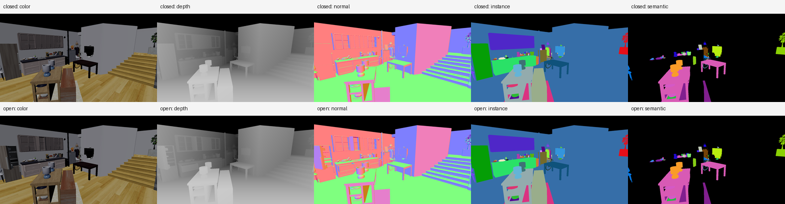

# Flora（RTXNS）引擎周报：ReplicaCAD 多模态 Sensor 与 Genesis 风格接口

> 汇报日期：2026-07-18（Iteration A / Week A4）
>
> 开发基线：`a36df2f`
>
> 硬件：NVIDIA GeForce RTX 3070 Laptop GPU（8 GB），驱动 610.74
>
> 数据集：`E:\cplus\Flora\ReplicaCAD`，重点场景 `apt_0`
>
> 本周范围：Color/Depth/Normal/Instance/Semantic 对齐输出、稳定标签、动态多相机 Sensor API、Genesis 风格包装、性能基线、1000 帧稳定性
>
> 不在本周范围：`B>1` 独立环境、GPU PoseSource、GPU Tensor/DLPack、异步多产品 readback、物理求解、渲染质量优化

## 概述

本周完成 ReplicaCAD Iteration A 的第四阶段。Flora 已在 A3 完整动态场景的基础上，增加一条一次 scene refresh、一次 command list、多个 camera 的多模态 Sensor 路径。每个 camera 请求可按需返回 Color、Depth、Normal、Instance 和 Semantic，Python 端统一解码为拥有独立连续内存的 `SensorFrame`。

`apt_0` 的 120 个逻辑实例标签在编译时固化：stage、113 个普通对象和 6 个 articulated object 都使用稳定非零 Instance ID，0 只表示背景。普通对象继承 ReplicaCAD object config 的 Semantic ID；stage、背景和当前没有语义配置的 articulated object 使用 0。一个 articulated object 的所有 URDF link/visual 继承其 articulation root 的 Instance ID，关节运动不会改变对象身份。

1280×720 关闭/打开关节实验均通过：Depth、Normal、Instance 的有效像素掩码逐像素完全一致；关闭姿态有 786,375 个有效像素、61 个可见实例和 27 个可见语义值。20 个可见实例的代表像素与 manifest 标签一致，全图 Instance→Semantic 映射也完全一致。3 m 正对相机平面的线性 Depth 误差为 `2.861e-6 m`。

128×96、每批更新 26 个关节、RT off、同步 CPU readback 的正式实验中，五产品在 N=1/4/8 分别达到 `807 / 1,212 / 1,177 cam-FPS`。Color-only 为 `1,773 / 3,671 / 4,082 cam-FPS`。五产品每相机 payload 是 Color-only 的 7 倍，并新增 GBuffer 和 MaterialID pass，因此 N=8 五产品仅保留 Color-only 吞吐的 28.8%。该结果明确了 Iteration B 的优化重点应是 GPU OutputArena、减少 CPU 下载和产品 pass/pack 优化，而不是重新尝试多 cmdList。

1000 帧动态五产品压力测试通过。所有帧的有效像素掩码和标签映射正确；恢复 pose 0 后五个产品的 SHA-256 均与参考帧完全一致。原生 node handle 保持 `380 -> 380`，mesh/geometry/material/vertex/index 统计不变，RSS 仅增长 `0.63 MiB`。

| 本周指标 | A3 / 周初 | A4 / 周末 | 结果 |
|---|---:|---:|---|
| Sensor 产品 | RGBA8 | RGBA/Depth/Normal/Instance/Semantic | 完成 |
| 稳定逻辑标签 | 无像素输出 | 120 个非零 Instance ID | 完成 |
| 1280×720 有效掩码对齐 | 无 | 786,375 像素全图一致 | 通过 |
| Instance→Semantic | 无 | 20 个代表像素 + 全图映射 | 通过 |
| 3 m Depth reference | 无 | 误差 `2.861e-6 m` | 通过 |
| N=8 五产品吞吐 | 无 | `1,177 cam-FPS` | 建立基线 |
| 动态多产品长稳态 | 无 | 1000 帧通过 | RSS +0.63 MiB |
| Python 调用 | Color bytes/NumPy | `SensorFrame` 单/多相机 API | 完成 |

---

## 一、问题与目标

### 1. A3 之后的实际缺口

A3 已经能够完整加载 ReplicaCAD stage、普通家具和 articulated object，也能用稳定 handle 批量更新关节矩阵，但它只能稳定输出 Color。对于具身智能仿真，Color 之外至少还需要：

1. Depth：用于点云、几何感知、避障和深度学习输入。
2. Instance：区分同类别的不同物体，并在运动前后保持身份稳定。
3. Semantic：将像素映射回 ReplicaCAD 的类别标签。
4. Normal：提供表面方向，可用于抓取、重建和几何监督。
5. 同帧对齐：所有产品必须来自同一个 scene pose 和 camera，不能在逐产品渲染之间发生物理状态更新。

如果五个产品分别走五次 `render_frame()`，不仅重复 SceneGraph/TLAS 工作，也不能保证外部仿真器在调用间没有推进状态。因此 A4 需要的是一个带 product mask 的 camera sensor 请求，而不是五个互不相关的截图函数。

### 2. A4 验收目标

1. 明确每个产品的 shape、dtype、坐标系、单位和背景值。
2. Color、Depth、Normal、Instance、Semantic 来自同一个 scene refresh 和 camera view。
3. Depth/Normal/Instance 的几何有效像素逐像素一致。
4. 至少 20 个可见对象的 Instance/Semantic 与编译标签一致，并做全图查表验证。
5. 使用解析几何验证线性 Depth，而不是只观察灰度图。
6. 外部脚本只提交 pose 和 camera，即可得到结构化 `SensorFrame`。
7. 建立 N=1/4/8 五产品相对 Color-only 的吞吐基线。
8. 1000 帧动态渲染无 ID 漂移、输出漂移或资源增长。

---

## 二、输出合约

### 1. 产品格式

| 产品 | Python shape | dtype | 定义 | 背景值 |
|---|---|---|---|---|
| Color | `[H, W, 4]` | `uint8` | RGBA8，沿用现有 Flora color readback | `(0,0,0,0)` |
| Depth | `[H, W]` | `float32` | 相机光轴方向线性距离，单位米 | `0.0` |
| Normal | `[H, W, 3]` | `float32` | world-space unit shading normal | `(0,0,0)` |
| Instance | `[H, W]` | `uint32` | 稳定逻辑对象 ID | `0` |
| Semantic | `[H, W]` | `uint32` | ReplicaCAD semantic ID | `0`（背景或 unknown） |

注意：Semantic 的 0 同时表示背景和 unknown，因此不能用 `semantic > 0` 构造几何有效像素。几何有效掩码应使用 `depth > 0` 或 `instance > 0`。

### 2. 稳定 ID 生命周期

编译器将 source instance ID 映射为输出 ID：

```text
output_instance_id = compiled_instance_id + 1
```

这样保证 0 始终保留给背景。`apt_0` 的分配为：

- stage：ID 1；
- 113 个普通对象：ID 2～114；
- 6 个 articulated object：ID 115～120；
- articulation 内所有 URDF visual 继承 root ID，不按 link 重新编号。

原生 `set_node_labels()` 会拒绝 ID 0、重复逻辑节点和重复非零 Instance ID。每次调用从默认映射重新构建候选表，所有验证通过后才原子替换，避免部分写入或二次配置残留旧标签。

### 3. SensorFrame 所有权

pybind 返回的是临时 byte payload。`python/rtxns_genesis_style/sensor.py` 在验证精确字节长度后执行 C-order copy，确保每个 NumPy 产品：

- shape/dtype 符合合约；
- `C_CONTIGUOUS=True`；
- `OWNDATA=True`；
- 不引用下一帧可能复用的原生或 Python byte buffer。

这为后续异步多产品 ring 奠定了明确的数据所有权边界。

---

## 三、原生实现

### 1. 一次刷新、多产品录制

当前五产品批量路径为：

```text
Scene::Refresh once
  -> optional Color forward pass
  -> per camera GBuffer pass: D32 + RGBA16_SNORM world normal
  -> per camera MaterialID pass: raw Donut mesh instance index
  -> copy requested geometry targets to staging
  -> one execute + waitForIdle
  -> CPU readback and raw ID -> stable label mapping
```

同一个 batch 的 camera 都在一次 `Scene::Refresh()` 之后录制，因此观察同一组对象位姿。当前仍为同一 graphics queue 上的顺序 camera pass；A4 没有重新引入已被否定的 multi-cmdList 路径。

### 2. 复用 Donut GBuffer 与 MaterialID

A4 没有新写一套几何 shader，而是复用 Donut 的成熟 pass：

- `GBufferFillPass` 写入 D32 深度和 RGBA16_SNORM shading normal；
- `MaterialIDPass` 的 shader 输出 `startInstanceLocation + i_instance`；
- CPU 端使用 mesh instance index 查稳定 Instance/Semantic 表；
- opaque、alpha-tested 和 transparent draw strategy 在 GBuffer/ID 两条路径中保持一致。

这种实现优先保证正确性和与 SceneGraph 的兼容性。代价是即使只请求 Depth，当前也会建立完整 GBuffer target；即使只请求 ID，也依赖一次 depth-producing GBuffer pass。pass 裁剪和目标精简属于后续性能工作。

### 3. 深度线性化

D32 normalized depth 使用当前非反转 D3D/Vulkan `[0,1]` 投影约定，CPU 转换为光轴距离：

```text
z_linear = near * far / (far - depth * (far - near))
```

clear depth 1.0 被转换为背景 0，而不是 far plane。3 m 正对 camera 的 reference quad 实测中心像素误差为 `2.861e-6 m`，远小于 A4 的 `1e-4 m` 容差。

### 4. 关键代码入口

| 文件与位置 | 作用 |
|---|---|
| `src/PythonBindings/headless_pbr.h:115` | `SensorProduct` mask 和原生 `SensorFrame` |
| `src/PythonBindings/headless_pbr.cpp:632` | 原子标签映射、唯一 ID 校验和祖先继承 |
| `src/PythonBindings/headless_pbr.cpp:1681` | GBuffer/MaterialID 录制与 staging copy |
| `src/PythonBindings/headless_pbr.cpp:2023` | Depth/Normal/ID readback 和格式转换 |
| `src/PythonBindings/headless_pbr.cpp:2219` | 单 cmdList 多相机 sensor batch |
| `src/PythonBindings/headless_pbr.cpp:2581` | camera slot 的惰性 sensor target 创建 |
| `src/PythonBindings/py_bindings_common.h:167` | product 名称校验与 Python byte payload |

---

## 四、ReplicaCAD 与 Python 接口

### 1. 编译期标签

`CompiledDonutScene.sensor_labels` 为 stage、普通对象和 articulation root 生成有序标签。metadata schema 从 2 升级到 3，并将 `sensor_labels` 写入 `.donut_scene.manifest.json`，使实验结果可以追溯到 node name、instance ID、semantic ID 和 kind。

关键入口：

| 文件与位置 | 作用 |
|---|---|
| `python/donut_render_py/donut_scene_compiler.py:275` | `CompiledSensorLabelDesc` |
| `python/donut_render_py/donut_scene_compiler.py:426` | 稳定标签生成 |
| `python/donut_render_py/donut_scene_compiler.py:447` | 一次配置原生标签 |
| `python/donut_render_py/donut_scene_compiler.py:609` | metadata schema 3 |
| `tests/test_replicacad_articulation.py:62` | ID 连续性、唯一性和 0 保留测试 |

### 2. Genesis 风格接口

`GenesisStyleRenderer` 和最外层 `donut_render_py.Scene` 均提供：

```python
frame = renderer.render_sensor(
    camera,
    products=("color", "depth", "normal", "instance", "semantic"),
)

frames = renderer.render_sensor_batch(
    cameras,
    products=("depth", "instance"),
)
```

返回值是 `SensorFrame`，未请求的字段为 `None`。product 名称会统一转小写、去重并拒绝未知名称；空 product 请求也会明确报错。

直接使用编译后 ReplicaCAD 场景时：

```python
compiled.configure_sensor_labels(native_scene)
raw = native_scene.render_sensor_batch([0, 1], list(products))
frames = decode_sensor_frames(raw)
```

接口烟雾测试覆盖两层：

- `GenesisStyleRenderer`：两个 camera、五产品、刚体矩阵增量更新、部分产品请求；
- `donut_render_py.Scene`：公开 Scene 生命周期、五产品、部分产品 batch 和 3 m Depth reference。

### 3. 关键 Python 入口

| 文件与位置 | 作用 |
|---|---|
| `python/rtxns_genesis_style/sensor.py:12` | product 规范化 |
| `python/rtxns_genesis_style/sensor.py:26` | `SensorFrame` 合约 |
| `python/rtxns_genesis_style/sensor.py:76` | byte payload 安全解码 |
| `python/rtxns_genesis_style/renderer.py:1050` | build 后配置稳定 shape 标签 |
| `python/rtxns_genesis_style/renderer.py:1093` | 单相机 sensor API |
| `python/rtxns_genesis_style/renderer.py:1107` | 多相机 sensor batch |
| `python/donut_render_py/runtime.py:1532` | 公开 Scene sensor 包装 |

---

## 五、1280×720 正确性与结果图

### 1. 实验设置

```text
场景：ReplicaCAD apt_0 完整场景
相机：position=(3.5,2.0,3.5), target=(0,1,0)
分辨率：1280×720
产品：Color + Depth + Normal + Instance + Semantic
阴影：RT off（隔离 Sensor 正确性）
动态：打开冰箱门、厨房抽屉、橱柜门、抽屉柜、cabinet 和房门，共 7 个关节
```

关闭/打开姿态的五产品总览：



单产品原图保存在 `output/replicacad_a4/apt_0_{closed,open}_{color,depth,normal,instance,semantic}.png`。

### 2. 五产品对齐结果

| 指标 | Closed | Open |
|---|---:|---:|
| 有效几何像素 | 786,375 | 786,375 |
| 有效像素比例 | 85.327% | 85.327% |
| 可见 Instance | 61 | 61 |
| 可见 Semantic 值 | 27 | 27 |
| Depth 最小值 | 2.0363 m | 2.0363 m |
| Depth 最大值 | 8.9523 m | 8.9523 m |
| Normal 单位长度平均误差 | `1.50e-8` | 同量级 |
| Normal 单位长度最大误差 | `1.19e-7` | `1.19e-7` |
| Depth/Normal/Instance 掩码 | 完全一致 | 完全一致 |
| Instance→Semantic 全图映射 | 完全一致 | 完全一致 |

20 个样本不是随意选一个可能落到别的遮挡物上的包围盒中心，而是对每个可见 Instance 计算投影像素质心，并选择距离质心最近的真实该 ID 像素。脚本验证代表像素的 Instance/Semantic，同时对全图所有像素执行 LUT 比较；后者比只抽样 20 个对象更严格。

### 3. 动态产品变化

| 产品 | Closed/Open 变化像素比例 | 解释 |
|---|---:|---|
| Color | 4.687% | 关节几何、遮挡和光照变化 |
| Depth | 4.939% | 表面位置/遮挡变化 |
| Normal | 4.430% | 表面方向和可见面变化 |
| Instance | 0.148% | 运动 articulation 与背景/其他对象边界变化 |
| Semantic | 0% | 运动对象当前 semantic 为 unknown 0，保持稳定是正确行为 |

Semantic 不变化不表示关节没有运动。它说明当前 7 个运动关节所属 articulation 的语义值均为 0；Depth、Normal、Instance 和 Color 已共同证明几何发生变化。未来可在 articulation template 获得可靠类别表后补充 semantic，而不改变 Instance 生命周期。

---

## 六、动态多相机性能

### 1. 实验设置

```text
设备：RTX 3070 Laptop 8 GB
场景：apt_0 完整动态场景，171 native mesh instances
分辨率：128×96
维度：B=1, C=1/4/8
动态更新：每 batch 更新 26 个 movable joint
阴影：RT off
端点：同步 CPU bytes readback
配置：30 warmup + 200 batches × 3 trials
统计：trial 中位数；Color/all-products 顺序交替
```

这是 A4 CPU reference 性能，不是 GPU-ready SAPIEN 对标数据。

### 2. Color-only 与五产品

| C | Color cam-FPS | 五产品 cam-FPS | 五产品/Color | Color batch | 五产品 batch | 新增 batch |
|---:|---:|---:|---:|---:|---:|---:|
| 1 | 1,773 | 807 | 45.5% | 0.564 ms | 1.239 ms | 0.675 ms |
| 4 | 3,671 | 1,212 | 33.0% | 1.090 ms | 3.301 ms | 2.211 ms |
| 8 | 4,082 | 1,177 | 28.8% | 1.960 ms | 6.799 ms | 4.839 ms |

每相机 payload：

```text
Color-only:   49,152 bytes = 128 × 96 × 4
Five-product: 344,064 bytes = 128 × 96 × (4 + 4 + 12 + 4 + 4)
```

五产品 payload 恰好是 Color-only 的 7 倍；此外还增加 GBuffer 和 MaterialID 两次几何相关 pass。N 增加时这些 per-camera 成本顺序累积，所以五产品在 N=4 后接近平台，并在 N=8 轻微回落。

### 3. CPU record 分解

| C | Scene Refresh record | Sensor record | 26 关节 pose write |
|---:|---:|---:|---:|
| 1 | 0.173 ms | 0.327 ms | 0.021 ms |
| 4 | 0.226 ms | 1.030 ms | 0.029 ms |
| 8 | 0.227 ms | 2.011 ms | 0.034 ms |

`sensor_record_cpu_ms` 是 CPU command recording 时间，不是 GPU timestamp。它随 C 近似线性增长，符合每相机顺序录制 GBuffer/ID pass 的实现。总 batch 的其余时间还包括 GPU execute、wait、staging map/copy、pybind bytes 和 Python 处理，不能用表中字段相减得到精确 GPU 时间。

### 4. 性能结论

1. A4 五产品功能正确，但同步 CPU readback 不是目标生产端点。
2. 26 关节 pose write 仍只有约 `0.02～0.03 ms/batch`，不是主要瓶颈。
3. 多产品新增成本随 camera 数量增长，N=8 的主要问题不是 Scene Refresh，而是 per-camera pass 与 readback。
4. 再拆 cmdList 只会增加提交开销，不会解决这些成本。
5. B2/B3 应优先实现 GPU PoseSource、GPU OutputArena 和显式下载；B4 再根据 GPU timestamp 决定合并 ID/GBuffer、裁剪未请求 target 或使用 multiview。

---

## 七、1000 帧动态稳定性

### 1. 压力设置

```text
场景：apt_0
分辨率：64×48
B/C/P：B=1, C=1, P=5
动态：每帧更新 26 个关节
阴影：RT off
热身：30 帧
正式：1000 帧
```

### 2. 结果

| 检查项 | 结果 |
|---|---|
| Depth/Normal/Instance 掩码错误帧 | 0 / 1000 |
| 未注册 Instance ID 帧 | 0 / 1000 |
| Instance→Semantic 错误帧 | 0 / 1000 |
| pose 0 恢复后的五产品哈希 | 5 / 5 完全一致 |
| native node handle | 380 -> 380 |
| mesh / geometry / material | 171 / 127 / 111，前后不变 |
| vertex / index | 326,228 / 414,018，前后不变 |
| scene artifact 每帧重写 | 0 次 |
| RSS | 341.65 MiB -> 342.28 MiB，`+0.63 MiB` |

### 3. 每帧耗时

| 阶段 | 平均耗时 |
|---|---:|
| 26 关节 native pose write | 0.0166 ms |
| `Scene::Refresh` CPU record | 0.1457 ms |
| Sensor pass CPU record | 0.2596 ms |
| execute + readback + decode wall | 0.8819 ms |
| 完整 stress loop wall | 0.9833 ms |

恢复哈希覆盖 Color、Depth、Normal、Instance 和 Semantic 的原始数组 bytes。它证明动态运行后不仅 RGB 恢复，浮点深度/法线和 ID 产品也没有积累状态、标签漂移或 staging 污染。

---

## 八、代码交付清单

| 文件 | A4 改动 |
|---|---|
| `src/PythonBindings/headless_pbr.h/.cpp` | Sensor mask/frame、GBuffer/ID target、标签映射、批量录制、readback |
| `src/PythonBindings/py_bindings_common.h` | product 名称绑定和五产品 byte payload |
| `python/donut_render_py/donut_scene_compiler.py` | `CompiledSensorLabelDesc`、schema 3、原生标签配置 |
| `python/donut_render_py/runtime.py` | 公开 Scene 的单/多相机 sensor API |
| `python/donut_render_py/__init__.py` | 导出 SensorFrame、产品和编译标签类型 |
| `python/rtxns_genesis_style/sensor.py` | 输出合约、product 校验、安全 NumPy 解码 |
| `python/rtxns_genesis_style/renderer.py` | Genesis 风格单/多相机 SensorFrame 路径 |
| `tests/test_sensor_products.py` | product、shape、dtype、所有权和非法 payload 测试 |
| `tests/test_replicacad_articulation.py` | 标签顺序、唯一性和背景 0 回归 |
| `tools/render_replicacad_multimodal.py` | 1280×720 五产品图、动态对齐和标签验收 |
| `tools/bench_replicacad_multimodal.py` | N=1/4/8 Color/五产品正式对照 |
| `tools/stress_replicacad_multimodal.py` | 1000 帧哈希、标签和资源压力测试 |
| `tools/donut_render/genesis_multimodal_smoke.py` | Genesis 风格双相机/动态 pose/Depth reference |
| `tools/donut_render/runtime_multimodal_smoke.py` | 最外层 `donut_render_py.Scene` API 验收 |

主要结果文件：

```text
output/replicacad_a4/apt_0.donut_scene.json
output/replicacad_a4/apt_0.donut_scene.manifest.json
output/replicacad_a4/apt_0_{closed,open}_{color,depth,normal,instance,semantic}.png
output/replicacad_a4/apt_0_multimodal_contact_sheet.png
output/replicacad_a4/apt_0_multimodal_metrics.json
output/replicacad_a4/apt_0_multimodal_benchmark.json
output/replicacad_a4/apt_0_multimodal_stress.json
```

---

## 九、测试与复现

### 1. 原生构建

```powershell
cmake --build E:\cplus\Flora\build-flora `
  --config Release --target DonutRenderPyNative
```

结果：Release 构建通过；仅存在项目原有 C4819 和 `APIENTRY` 重定义 warning。

### 2. Python 单元与编译器回归

```powershell
E:\python\python.exe -m unittest `
  tests.test_sensor_products `
  tests.test_replicacad_articulation `
  tests.test_replicacad_assembly `
  tests.test_replicacad_manifest `
  tests.test_replicacad_transforms
```

结果：`29 / 29` 通过。

### 3. Genesis 与公开 Scene API

```powershell
E:\python\python.exe tools\donut_render\genesis_multimodal_smoke.py
E:\python\python.exe tools\donut_render\runtime_multimodal_smoke.py
```

结果：两项通过；Depth reference 误差 `2.861e-6 m`。

### 4. 1280×720 五产品结果

```powershell
E:\python\python.exe tools\render_replicacad_multimodal.py `
  --width 1280 --height 720
```

结果：120 个标签、61 个可见实例、786,375 个有效像素，全部检查通过。

### 5. 正式性能基线

```powershell
E:\python\python.exe tools\bench_replicacad_multimodal.py `
  --cameras 1 4 8 --batches 200 --warmup-batches 30 --trials 3
```

### 6. 1000 帧长稳态

```powershell
E:\python\python.exe tools\stress_replicacad_multimodal.py `
  --frames 1000 --warmup-frames 30
```

---

## 十、A4 验收结论

| A4 验收项 | 状态 | 证据 |
|---|---|---|
| 五产品 shape/dtype/背景值明确 | 通过 | SensorFrame 合约 + 单元测试 |
| 同 scene frame 多相机多产品 | 通过 | single Refresh/cmdList + 双相机 smoke |
| Depth/Normal/Instance 像素对齐 | 通过 | 1280×720 全图掩码一致 |
| 至少 20 个对象标签正确 | 通过 | 20 个代表像素 + 全图 LUT |
| Depth 几何 reference | 通过 | 3 m 误差 `2.861e-6 m` |
| 动态 PoseBatch 驱动观测 | 通过 | 26 关节 ReplicaCAD + Genesis 刚体 smoke |
| 1000 帧无 ID/资源漂移 | 通过 | 五产品哈希、资源统计、RSS |
| N=1/4/8 多产品性能基线 | 通过 | `807 / 1,212 / 1,177 cam-FPS` |

A4 可以收尾，Iteration A 的“完整 ReplicaCAD 动态场景 + 多模态 Sensor + Python 调用边界”已经形成闭环。

---

## 十一、当前边界与下一步

### 1. 当前边界

- 当前多产品路径为同步 CPU readback；Color-only 才有成熟异步 ring。
- 当前环境维度仍是 `B=1`，多个 camera 共享同一个对象状态。
- 位姿输入仍经过 CPU/pybind matrix，输出为 NumPy；没有 DLPack/Torch/Taichi 零拷贝。
- Normal 是 world-space shading normal，不是 geometric normal 或 camera-space normal。
- articulated object 当前 Semantic 为 0；需要可靠类别来源后再补标签，不应猜测。
- 当前统计以 CPU record/wall 为主，尚无 Vulkan GPU timestamp 和逐 pass GPU 曲线。
- GBuffer 当前创建/写入的 target 多于最终消费量，ID 仍是第二次几何 pass。
- 透明表面的 Instance 表示 GBuffer/ID 规则下的前方可见表面，不等价于 Color alpha compositing 中的所有贡献对象。

### 2. 下一周建议：Week B1

下一项应进入 `CompiledSceneBatch + B>1 独立环境`，而不是继续调整 A4 的同步 CPU path。

建议交付：

1. 一个 topology/asset 编译结果创建 `B=1/2/4/8` 个环境状态。
2. 每个环境具有独立 rigid/link pose、visibility/active mask 和 camera state。
3. immutable mesh/texture/material/BLAS 不按 B 重复加载。
4. 提供 `env_index + logical_handle` 或连续 `[B,N]` 状态索引。
5. 增加环境隔离测试：只移动 env 3 的一个物体，其他环境的 Depth/Instance 哈希不变。
6. 输出 B=1/2/4/8 的 build time、RSS/VRAM、asset count、pose update 和 CPU reference 吞吐。
7. B1 先复用 A4 Sensor correctness reference；GPU PoseSource 和 GPU OutputArena 分别在 B2/B3 完成。

B1 的周报核心不应只是“能复制 8 份场景”，而应证明：8 个环境状态相互独立，资产确实共享，内存不会按完整场景大小线性重复，且现有五产品标签在环境复制后仍可确定地解释。
