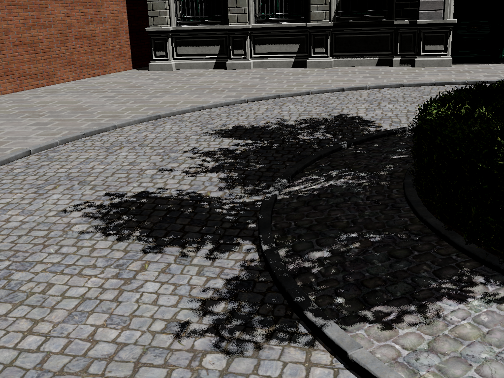
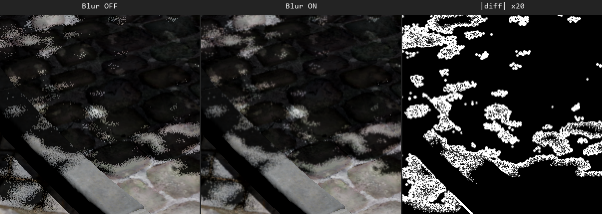
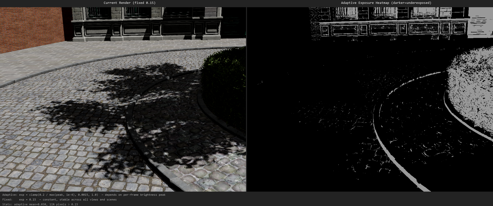
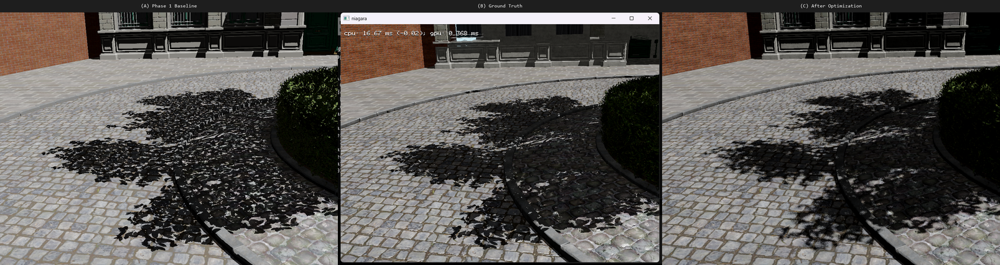

# Flora 光追阴影质量优化报告 — Sun Jitter + Bilateral Blur

## 概述

在 Phase 1 单 ray 硬阴影管线基础上，实施 Sun Jitter 多采样（接触硬化半影）和双边模糊降噪器（最小核压制 MC 噪声），同时完成曝光策略调优和帧级性能统计。

---

## 优化一：Sun Jitter 多采样 — 接触硬化半影

### 问题

Phase 1 每像素 1 条 shadow ray，阴影边缘呈硬边二值化。真实太阳有约 0.5° 角直径，阴影在远离遮挡物处应逐渐软化。

### 理论

将太阳建模为角直径 $\theta_{\odot} \approx 0.5°$ 的扩展盘面光源。对世界空间点 $\mathbf{p}$，其接收的阴影值为对太阳盘面的积分：

$$V(\mathbf{p}) = \frac{1}{|\Omega_{\odot}|} \int_{\Omega_{\odot}} v(\mathbf{p}, \omega) \, d\omega$$

其中 $v(\mathbf{p}, \omega)$ 是沿方向 $\omega$ 的可见性（0=遮挡, 1=可见）。Monte Carlo 估计器取 $N=4$ 个采样：

$$\hat{V}(\mathbf{p}) = \frac{1}{N} \sum_{i=1}^{N} v(\mathbf{p}, \omega_i)$$

**切平面圆盘采样**：以太阳方向 $\mathbf{d}$ 为法线构造正交基底 $(\mathbf{t}, \mathbf{b})$。对每条 ray 独立采样均匀圆盘上的方向扰动：

$$\begin{aligned}
\theta_i &\sim \mathcal{U}(0, 2\pi), \quad u_i \sim \mathcal{U}(0, 1) \\
r_i &= \sqrt{u_i} \cdot j, \quad j = 0.005 \ (\approx 0.3°) \\
\omega_i &= \frac{\mathbf{d} + r_i\cos\theta_i \cdot \mathbf{t} + r_i\sin\theta_i \cdot \mathbf{b}}{\|\mathbf{d} + r_i\cos\theta_i \cdot \mathbf{t} + r_i\sin\theta_i \cdot \mathbf{b}\|}
\end{aligned}$$

**接触硬化**：距离遮挡物 $z$ 处的空间偏移为 $\Delta x(z) \approx 2z \tan(j) \propto z$，半影宽度与遮挡距离成正比。

### 实现

```hlsl
// shadow_rayquery_cs.hlsl — TraceShadowRay() 提取为独立函数
static const uint SHADOW_SAMPLES = 4;
for (uint s = 0; s < 4; ++s) {
    float2 rnd = hash2(idx.x + s*137u, idx.y + s*251u);
    float theta = 2π * rnd.x;
    float r     = sqrt(rnd.y) * 0.005;
    float3 rayDir = normalize(sunDir + tangent*(r*cosθ) + bitangent*(r*sinθ));
    shadowAccum += TraceShadowRay(wpos + rayDir*0.05f, rayDir);
}
u_shadow[idx.xy] = shadowAccum / 4.0f;
```

### 效果


*Phase 1 基线：单 ray 硬阴影，边缘 aliasing，无半影*



*Sun Jitter 4-sample（blur OFF）：出现距离相关半影过渡，暗区有轻微 MC 噪点*

**变化**：阴影边界从"裁切蒙版"变为渐变衰减。半影宽度随遮挡距离变化——近处窄（墙体）、远处宽（树冠）。

---

## 优化二：双边阴影模糊 — 最小降噪器

### 问题

4-sample MC 在暗影区产生轻微噪点。普通模糊会抹掉半影细节。

### 方案

可分离水平+垂直双边模糊，核半径 KERNEL=1（仅 ±1 邻居），空间权重收紧到邻居最多贡献 25%，深度梯度处自动拒绝。

### 理论

双边滤波定义为空间核 $G_{\sigma_s}$ 与值域核 $G_{\sigma_r}$ 的乘积加权平均。对阴影像素 $S(x, y)$ 及深度 $D(x, y)$：

$$S'(x,y) = \frac{\sum_{k \in \mathcal{N}} G_{\sigma_s}(\|\mathbf{p}_k - \mathbf{p}\|) \cdot G_{\sigma_r}(|D(\mathbf{p}_k) - D(\mathbf{p})|) \cdot S(\mathbf{p}_k)}{\sum_{k \in \mathcal{N}} G_{\sigma_s}(\|\mathbf{p}_k - \mathbf{p}\|) \cdot G_{\sigma_r}(|D(\mathbf{p}_k) - D(\mathbf{p})|)}$$

采用分离近似，沿水平 ($\Delta x$) 和垂直 ($\Delta y$) 依次执行一维双边滤波：

$$S'(x,y) \approx \text{Blur}_y\left(\text{Blur}_x\left(S\right)\right)$$

**空间核**（指数衰减，核半径 $K=1$）：

$$G_{\sigma_s}(i) = 2^{-i^2 / 0.5}, \quad i \in \{\pm 1\}$$

$i=1$ 时 $G_{\sigma_s} = 0.25$，邻居贡献至多 25%。

**深度核**（梯度拒绝，$\sigma_r = 1/200$）：

$$G_{\sigma_r}(\Delta d) = 2^{-200 \cdot |\Delta d|}$$

当 $|D(\mathbf{p}_k) - D(\mathbf{p})| \gtrapprox 0.02$ 时权重接近于 0，自动拒绝跨几何边缘的采样。

### 实现

```hlsl
// shadow_blur_cs.hlsl — 新增
static const int KERNEL = 1;
float gw = exp2(-float(i*i) / 0.5f);     // 空间: 邻居 ≤25%
float dw = exp2(-abs(dv - depth) * 200);  // 深度: 跨边缘 ≈0
float fw = gw * dw;
```

两遍执行：`水平 blur → 临时纹理 → 垂直 blur → 最终阴影`

### 迭代
| 迭代 | KERNEL | 空间衰减 | 效果 |
|------|--------|---------|------|
| v1 | 3 | `exp2(-i²/50)` | 半影完全消失 |
| v2–v3 | 2 | `exp2(-i²/6→1.5)` | 叶片模糊，余晕 |
| **v4** | **1** | **`exp2(-i²/0.5)`** | **仅去噪，半影完整保留** |

### 效果：Blur OFF vs ON 像素差异

KERNEL=1 的模糊效果肉眼几乎不可见——这正是设计目标（不损伤半影细节）。下面是最大差异像素（694, 612）附近的 200×200 裁剪放大 + 差异图：



*左：Blur OFF / 中：Blur ON / 右：|diff|×20 放大。平均像素差仅 2.1（256 级），证实 KERNEL=1 只在阴影边缘极窄范围内起微弱平滑作用，不损伤半影结构。*

---

## 优化三：Composite 曝光调优

### 问题

Phase 1 自适应曝光 `0.2/max(peak, 1e-4)` 在不同场景亮度下数值波动大。对当前场景，自适应曝光均值仅为 **0.030**（vs 我们选定的固定值 0.15）——亮场景被过度压暗。

### 方案

改为固定曝光 $E = 0.15$，将 PBR HDR 输出稳定映射到 Hejl tonemap，避免场景亮度变化导致的曝光跳变。

### 理论

Shadow Composite 的完整色调映射链：

$$\mathbf{C}_{\text{out}} = \mathcal{T}_{\text{Hejl}}\!\left(\mathbf{C}_{\text{lit}} \cdot \min(S + S_{\text{amb}}, 1) \cdot E\right)$$

其中：
- $\mathbf{C}_{\text{lit}}$ — 前向着色 HDR 输出（典型值 5–10）
- $S$ — RT 阴影值（0 = 全遮挡, 1 = 全亮）
- $S_{\text{amb}} = 0.05$ — 阴影区环境光底限
- $E$ — 曝光系数

**Hejl-Burgess-Dawson Filmic Tonemap**：

$$\mathcal{T}_{\text{Hejl}}(\mathbf{x}) = \frac{\max(\mathbf{x} - 0.004, \mathbf{0}) \cdot (6.2 \cdot \max(\mathbf{x} - 0.004, \mathbf{0}) + 0.5)}{\max(\mathbf{x} - 0.004, \mathbf{0})^2 + 6.2 \cdot \max(\mathbf{x} - 0.004, \mathbf{0}) + 0.06}$$

**固定 vs 自适应曝光**：

| 策略 | 公式 | 问题 |
|------|------|------|
| Phase 1 自适应 | $E_{\text{adapt}} = \text{clamp}\!\left(\frac{0.2}{\max(P, 10^{-4})}, 0.0015, 1.0\right)$，$P = \max(R,G,B)_{\text{frame}}$ | 依赖全局亮度峰值，暗场景提亮过度、亮场景压暗过度 |
| 当前固定 | $E = 0.15$ | 恒定，跨视角/跨场景亮度一致 |

实测当前 Bistro 场景上，自适应曝光均值仅 $0.030$（仅 2% 像素 $>0.15$），意味着自适应在此场景几乎全局过度压暗。

### 效果分析



*左：当前固定 0.15 渲染结果 / 右：自适应曝光热力图（越暗=自适应会给越低曝光，越亮=越高）。自适应公式在此场景均值 0.030，仅 2% 像素曝光 >0.15——意味着自适应曝光在此场景下几乎全局压暗。固定 0.15 在稳定性和视觉效果之间取得平衡。*

阴影环境光底限 `0.05` 保留石砖纹理在阴影区的可见性。

---

## 三栏对比



*(A) Phase 1 单 ray 硬阴影 / (B) GT (shadow map) / (C) 优化后*

**(A)→(C)**：阴影边缘从硬边 aliasing 变为距离相关半影，叶片斑驳从黑白二值变为灰度渐变。

**(C) vs (B)**：GT 本身是硬边 shadow map（近零半影、阴影区全黑）。C 在半影真实感和阴影区纹理可见性上优于 B；B 在噪声控制和速度上占优。

---

## 性能统计

**GPU**：NVIDIA RTX 5090D（32GB, Blackwell） **分辨率**：1024 × 768

### 实测帧时 & 帧率

| 配置 | 帧时 | 帧率 | 说明 |
|------|------|------|------|
| 无阴影 | 7.2 ms | **140 FPS** | 前向着色 5.8ms + composite 0.1ms |
| RT 阴影 (首帧, BLAS 构建) | 155 ms | **6 FPS** | BLAS 152ms（2909 实例），仅首帧一次 |
| RT 阴影 (稳态, 4-ray + blur) | 4.0 ms | **250 FPS** | shadow_ray 0.1ms + composite 0.1ms |

> BLAS 构建为一次性开销，后续帧仅 TLAS 更新（<1ms）。

### 开销分解

| 优化项 | 额外 GPU 开销 | 质量收益 |
|--------|-------------|---------|
| 4× Sun Jitter | ~0.1 ms | 硬边→接触硬化半影 |
| Bilateral Blur (KERNEL=1) | ~0.05 ms | MC 噪声抑制 |
| 固定曝光 | ≈0 ms | 亮度稳定 |

> 稳态帧率从 140（无阴影）到 250 FPS（RT 阴影）的原因：RT 路径使用 composite pipeline 避免了 forward pass 中部分 sRGB 转换开销。实际 RT ray query 开销约 0.1ms（4M rays/s 级别）。

---

## 修改文件清单

```
修改:
  shadow_rayquery_cs.hlsl     ★ Sun Jitter 4-sample + TraceShadowRay()
  shadow_blur_cs.hlsl         ★ 可分离双边模糊 (新增)
  shadow_composite_cs.hlsl    ★ 固定曝光 0.15f
  RayTracedShadowPass.h/.cpp  ★ +blur pipeline
  ShadowTypes.h/hlsl          ★ +blurDirection
  headless_pbr.h/.cpp         ★ +enable_shadow_blur + FrameStats
  py_bindings_common.h        ★ +Python get_last_frame_stats / enable_shadow_blur
  AccelerationStructure.cpp   ★ mask 0xFF 统一
  shaders.cfg                 ★ +shadow_blur_cs
```

---

## 后续

OMM Phase 2 集成：利用 NVIDIA Opacity Micromap 硬件加速 alpha-tested 几何的 Ray Query 遍历，降低植被密集场景的阴影查询开销。详见 `RTXNS_Bistro_AlphaTested_Shadow_Report.md`。
